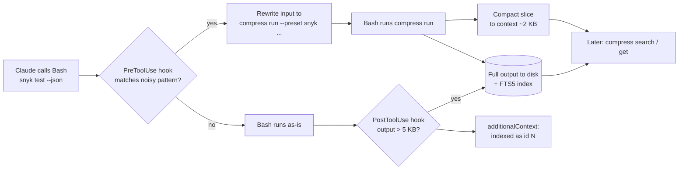

# ldm-compress: Context Compression Plugin — Design

2026-09-19 · @Someone

**For the orchestrating agent.** This document is the complete build specification for ldm-compress. Sections up to *Build plan* are the design and stay authoritative for *what* and *why*; *Build orchestration* onward is the executable spec for *how*, down to function signatures, file contents and acceptance commands. Read *Build orchestration* first — it says how to split the work, what to hand each worker, and how to verify. Every ambiguity is settled in *Decisions (settled for the build)*; do not stop to ask Rishi unless that section is silent. Do not commit or push anything.

## Problem & goals

Raw tool output is the single biggest thing eating the context window in our plugins, and the fix is to keep it on disk and hand Claude a slice.

Today ldm-appsec runs Snyk, SonarQube, Wiz and Dependabot in sequence. Each returns 80–400 KB of JSON straight into context. Four calls is roughly 250k tokens before the first fix is attempted. Compaction then drops earlier findings, Claude re-runs the tool, and every later turn re-sends the bloat. That is the "big plugins are slow" problem.

**v1 must:**

- Run any command, keep the full output on disk, return a capped or filtered slice to context.
- Make stored output searchable (BM25) so follow-ups never re-run the tool.
- Diff repeat runs of the same command, so a fix-and-rescan loop returns only what changed.
- Enforce this automatically via hooks, so a skill author does not have to remember, and Claude cannot drift back to raw calls mid-session.
- Snapshot working state before compaction and restore a short pointer after it.
- Be callable from any other plugin with one line in its SKILL.md and zero code.
- Run through Claude's normal Bash tool so permission prompts and allowlists still apply.
- Depend on nothing but Python 3.11+ stdlib.

**Non-goals for v1:**

- Other platforms (Cursor, Gemini CLI, Copilot). Claude Code only.
- An MCP execute sandbox. Deliberately excluded — see Security.
- Shrinking MCP tool results from other servers (Atlassian, GitHub MCP). Hooks cannot rewrite those responses; the fix there is inside the calling plugin.
- Token accounting dashboards, auto-upgrade, cross-machine sync.

## Architecture overview

Five small parts, one Python file doing the real work, and Claude's own Bash tool as the only executor.

| Component | What it is | Lives at |
| --- | --- | --- |
| `compress` CLI | Single Python package: run, search, get, index, stats, purge, preset | `bin/compress` (+ optional symlink in `~/.local/bin`) |
| Store | One SQLite DB (FTS5) + raw output files | `~/.cache/ldm-compress/` |
| Hooks | One dispatcher script handling all four events | `hooks/compress_hook.py`, wired by `hooks/hooks.json` |
| Skill | Tells Claude when and how to use `compress`; loaded on demand | `skills/compress/SKILL.md` |
| Presets | Named filters (`snyk`, `sonar`, `wiz`, `dependabot`) other plugins contribute | `~/.config/ldm-compress/presets.d/` |

Analogy: a prep kitchen. The hook is the maître d' redirecting orders, `compress run` is the cook, the store is the walk-in fridge, `compress search` is the runner fetching one ingredient.



The rewrite path costs zero extra turns: Claude asked for `snyk test --json`, the hook silently changed it to the wrapped form, Claude sees a short table. The PostToolUse path is the safety net for anything the patterns missed: it still lands in context, but is also indexed so it survives compaction.

## CLI interface

Six subcommands. `run` and `search` are the two Claude uses 95% of the time.

| Command | Does | Returns to context |
| --- | --- | --- |
| `compress run [opts] -- <cmd>` | Runs cmd, stores full stdout+stderr, indexes it | Filtered/capped slice + footer `[compress id=42 · 412 KB · exit 0]` |
| `compress search "<query>" [--id N] [--source S] [-k 5]` | BM25 over stored chunks | Top-k snippets with id, line range, score |
| `compress get <id> [--outline] [--lines 120:180] [--grep PATTERN]` | Slice of a raw output; `--outline` returns just its structure — headings, JSON keys, array counts — so Claude drills in instead of pulling the whole thing | Exactly what was asked, capped at `max_bytes` |
| `compress index <file\|-> --source <label>` | Chunks markdown/JSON/text into the index | One-line confirmation |
| `compress stats` | Sessions, ids, bytes stored vs bytes returned, offender list | Small table |
| `compress purge [--all\|--older-than 7d]` | Deletes outputs and index rows; baselines kept unless `--all` | Count removed |

**`compress run` options**

- `--preset <name>`: apply a named filter (see Calling it from other plugins). Presets set everything below.
- `--session <id>`: the Claude session this run belongs to. The PreToolUse rewrite injects it; when absent, `compress` reads `~/.cache/ldm-compress/current_session`, which every hook invocation keeps up to date.
- `--diff`: compare against the latest baseline for the same command shape in this repo — this session or a previous one — and print only the delta: `+2 new · −5 resolved · 130 unchanged`. Presets declare the row key (`id` for Snyk, `key` for Sonar) so the diff is per finding, not per line. The footer states the baseline's age and branch; a branch mismatch falls back to the full slice, as does a first run or a preset with no key.
- `--head N` / `--tail N`: default 40/10 lines when no preset or filter applies.
- `--filter <name or path>`: a built-in text filter (`head`, `tail`, `grep`, `outline`, `count`, `diff-stat`, `errors-only:<runner>`) or a `.py` file with `def filter(text: str) -> str`, loaded only from the plugin's presets dir, an installed plugin's preset dir, the repo root or the user config dir.
- `--json-path <expr> --fields a,b,c --where sev=critical,high --format table|json|lines`: declarative filter for JSON output; covers most scanner CLIs without writing Python.
- `--max-bytes 4096`: hard cap on what is printed, whatever the filter returns. Truncation is marked and the footer says how to get the rest.
- `--source <label>`: index label, default `run:<first word of cmd>`.
- `--no-index`: store but skip FTS5 (binary or useless output).
- `--keep`: survive `compress purge` on session end (rarely needed now baselines persist on their own).
- `--stderr last|full|none`: default `last` (last 5 lines echoed after the output).
- `--timeout <secs>`: kill the child after this long; exit 124 and the footer says so. No timeout by default.
- `--sh '<string>'`: run the string through `bash -lc` instead of argv. For hand-wrapping commands with pipes or redirects, which the hook never rewrites.

**Appsec examples**

```bash
# Claude wrote this, or the hook rewrote `snyk test --json` into it
compress run --preset snyk -- snyk test --json

#   PKG      CVE             SNYK_ID                 SEVERITY  FIXED_IN
#   lodash   CVE-2024-xxxx   SNYK-JS-LODASH-1234     critical  4.17.22
#   axios    CVE-2025-yyyy   SNYK-JS-AXIOS-5678      high      1.8.0
#   [compress id=42 · 412 KB stored · 2 findings shown · filtered from 61 · exit 1 · compress get 42 for more]

compress run --preset sonar -- curl -s "$SONAR_URL/api/issues/search?componentKeys=ldm-api&severities=CRITICAL,MAJOR"
compress run --preset dependabot -- gh api repos/CBA-General/ldm-api/dependabot/alerts

# follow-ups, no re-run
compress search "lodash prototype pollution" --id 42
compress get 42 --grep '"id": "SNYK-JS-LODASH'

# rescan after fixing lodash — only the delta comes back
compress run --preset snyk --diff -- snyk test --json
#   +0 new · −1 resolved · 1 unchanged · 1 high remain
#
#   RESOLVED
#   SNYK-JS-LODASH-1234
#   [compress id=45 · 401 KB stored · diff vs id=42 (2h ago, fix-snyk) · filtered from 60 · exit 1]

# ad hoc, no preset: head/tail + footer
compress run -- npm test
#   [compress id=46 · 88 KB stored · 50 of 1,204 lines shown · exit 1 · compress get 46 for more]
```

Exit code of `compress run` is the wrapped command's exit code, so `&&` chains and CI-style checks behave. Stderr is stored with stdout but only the last 5 lines are echoed unless `--stderr full`.

## Storage & search

One SQLite file, raw outputs beside it, everything keyed by Claude's `session_id`.

```
~/.cache/ldm-compress/
  compress.db                 # SQLite, WAL mode, 0600
  out/<session_id>/<id>.txt   # raw output, redacted, 0600
  state/<session_id>.md       # compaction snapshot (see Surviving compaction)
```

**Schema**

```sql
CREATE TABLE outputs (
  id INTEGER PRIMARY KEY, session_id TEXT, ts INTEGER,
  cmd TEXT, shape TEXT, cwd TEXT, branch TEXT, exit_code INTEGER, bytes INTEGER,
  returned INTEGER DEFAULT 0,
  path TEXT, source TEXT, preset TEXT, keep INTEGER DEFAULT 0
);
CREATE VIRTUAL TABLE chunks USING fts5(
  body, heading, source UNINDEXED, output_id UNINDEXED,
  line_start UNINDEXED, line_end UNINDEXED,
  tokenize = 'porter unicode61'
);
CREATE TABLE events (
  id INTEGER PRIMARY KEY, session_id TEXT, ts INTEGER,
  kind TEXT, priority INTEGER, summary TEXT, ref TEXT
);
CREATE TABLE offenders (
  shape TEXT PRIMARY KEY, example_cmd TEXT,
  last_bytes INTEGER, hits INTEGER, misses INTEGER
);
CREATE INDEX outputs_session ON outputs(session_id);
CREATE INDEX outputs_baseline ON outputs(shape, cwd, branch);
CREATE INDEX events_session ON events(session_id, priority, ts);
```

**Chunking** (picked by sniffing the first 1 KB)

| Input | Chunk rule | Heading field |
| --- | --- | --- |
| Markdown | Split on `#`–`###`, cap 1,500 chars with 200 overlap | The heading path `Auth > Token refresh` |
| JSON array or `{...: [...]}` | One chunk per top-level element, pretty-printed | Element index + first `id`/`name` key |
| JSON object | Per top-level key | Key name |
| Plain text / logs | 40-line windows, 5-line overlap | `lines 120–160` |

**Search**: `SELECT ... FROM chunks WHERE chunks MATCH ? ORDER BY bm25(chunks, 1.0, 2.0) LIMIT k` — weights follow column order (body, heading), so headings score 2× body. Query is passed through as FTS5 syntax after escaping, so `"exact phrase"`, `AND`, `NEAR()` work. Snippets come from `snippet()` at 64 tokens. No trigram or RRF in v1 — BM25 with Porter stemming is enough for CVE ids, package names and headings; note as v2 if recall on partial ids disappoints.

**Retention**: SessionStart purges sessions older than `retention_days` (default 7) and any session dir whose transcript no longer exists. One exception: the latest output per (repo, command shape, branch) survives as the `--diff` baseline for `baseline_retention_days` (default 30), so Monday's scan is Tuesday's delta. `compress purge --all` removes everything, baselines included. Deleting rows in SQLite normally leaves the freed pages inside the file, so the database is created with incremental auto-vacuum and every purge reclaims them — `compress stats` reports a `db_bytes` that actually goes down. Nothing is ever synced off the machine.

## Hooks

Four hooks, all `command` type, all exec-form Python, each under 100 ms. Contracts below are verified against the current [Claude Code hooks reference](https://code.claude.com/docs/en/hooks).

```json
{
  "hooks": {
    "PreToolUse":  [{ "matcher": "Bash", "hooks": [{ "type": "command", "command": "python3", "args": ["${CLAUDE_PLUGIN_ROOT}/hooks/compress_hook.py", "pre"], "timeout": 5 }] }],
    "PostToolUse": [{ "matcher": "Bash|Read|Grep|WebFetch|Edit|Write|MultiEdit", "hooks": [{ "type": "command", "command": "python3", "args": ["${CLAUDE_PLUGIN_ROOT}/hooks/compress_hook.py", "post"], "timeout": 10 }] }],
    "SessionStart": [{ "hooks": [{ "type": "command", "command": "python3", "args": ["${CLAUDE_PLUGIN_ROOT}/hooks/compress_hook.py", "session-start"], "timeout": 10 }] }],
    "PreCompact":  [{ "hooks": [{ "type": "command", "command": "python3", "args": ["${CLAUDE_PLUGIN_ROOT}/hooks/compress_hook.py", "pre-compact"], "timeout": 10 }] }]
  }
}
```

| Hook | Reads | Decides | Emits |
| --- | --- | --- | --- |
| PreToolUse (Bash) | `tool_input.command` | Matches a preset pattern, a user pattern, or a repeat offender — and is not already `compress run` | `updatedInput.command` = `<abs path>/bin/compress run --session <id> --preset X -- <original>`. Or `permissionDecision: deny` + reason when `mode = deny` |
| PostToolUse | `tool_response.content` size, `tool_name`, `tool_input` | Output > `index_threshold_bytes` (5 KB) and not from `compress` itself | Indexes it, records the offender shape, then `additionalContext`: `Indexed as compress id 43 (183 KB). compress search/get to query.` Also logs an event for Edit/Write/git commands |
| SessionStart | `source` | `startup`/`clear`: purge expired sessions (baselines kept), ensure the `~/.local/bin/compress` symlink when safe. `compact`/`resume`: read `state/<session>.md` | Plain-text stdout = the restore block (see next section). Empty on startup |
| PreCompact | `session_id`, `compact_mode` | Always | Writes `state/<session>.md` from the events table. Exits 0, never blocks compaction |

**PreToolUse rewrite, concretely**

```python
cmd = payload["tool_input"]["command"]
if cmd.lstrip().startswith(("compress ", route["bin"])): sys.exit(0)      # already wrapped
if has_shell_operators(cmd) or matches_any(route["never_wrap"], cmd): sys.exit(0)
preset = match_rule(route, cmd) or match_offender(route, shape_of(cmd))   # layer 1, then layer 2
if preset is None: sys.exit(0)
wrapped = (f"{shlex.quote(route['bin'])} run --session {payload['session_id']}"
           + (f" --preset {preset}" if preset != "_bare" else "") + f" -- {cmd}")
if cfg.mode == "rewrite":
    out = {"hookSpecificOutput": {"hookEventName": "PreToolUse",
           "updatedInput": {"command": wrapped}}}
else:
    out = {"hookSpecificOutput": {"hookEventName": "PreToolUse",
           "permissionDecision": "deny",
           "permissionDecisionReason": f"Large output. Re-run as: {wrapped}"}}
print(json.dumps(out))
```

The rewritten command goes through Claude's permission check again, so a rewrite never escalates what Claude was allowed to do. `rewrite` is the default because it costs no turns; `deny` exists for people who want Claude to see the redirect happen.

**Things the hooks deliberately do not do**

- Touch tool results from MCP servers. PostToolUse can see them but cannot shrink them; indexing them is still useful and is on by default.
- Run inside subagents differently. Hooks fire there too; outputs index under the same session.
- Block on failure. Any exception in a hook logs to `~/.cache/ldm-compress/hooks.log` and exits 0. A broken hook must never break Claude.

## Detection logic

Four layers decide when `compress` applies. All deterministic — `compress config show --why "<cmd>"` explains any decision in one line.

| Layer | When | Decides by | Result |
| --- | --- | --- | --- |
| 1. Preset match | Before the command runs (PreToolUse) | Regex from plugin presets and user/project patterns | Rewritten to `compress run --preset X -- <cmd>` |
| 2. Repeat offender | Before the command runs (PreToolUse) | The same command shape blew `index_threshold_bytes` last time | Rewritten to `compress run` with the best-matching built-in preset (`errors-only`, everyday pack), else default head/tail |
| 3. Size net | After the command runs (PostToolUse) | Output over 5 KB | Indexed, `additionalContext` pointer, and the command shape recorded for layer 2 |
| 4. Registration | Session start | Presets shipped by installed plugins | Layer 1 patterns appear without anyone editing config |

**Layer 2, "burned once, wrapped forever"** — closes the gap the first draft left open: a command with no preset that returns 400 KB lands raw exactly once, then never again.

- PostToolUse records `offenders(shape, example_cmd, last_bytes, hits)` when output exceeds the threshold. The shape is the command with numbers, paths and quoted strings normalised, so `gh api repos/x/alerts` and `gh api repos/y/alerts` share one row.
- Presets win over offenders: a preset is more specific and produces a better slice.
- Decay: two consecutive runs under the threshold delete the row, so a one-off spike does not wrap a command forever.
- `compress stats --offenders` lists rows by hits × bytes. That list is the backlog of presets worth writing.
- `auto_wrap_repeat` in config, default `true`; `false` keeps the table but only reports.

**Keeping PreToolUse fast.** It fires on every Bash call, so it never imports `sqlite3`. SessionStart and PostToolUse compile presets, user patterns and the offenders table into `~/.cache/ldm-compress/route.json`; PreToolUse reads that one file, runs the regexes, prints. Target under 30 ms including Python start-up. All four hooks are one script, `hooks/compress_hook.py <event>`, so there is one code path to test.

**Never triggers**: anything matching `never_wrap`, a command already starting with `compress` or the plugin's absolute `bin/compress` path, and MCP tool results (layer 3 indexes those, nothing rewrites them).

**To verify in phase 2**: whether Claude sees the rewritten command or only its own original in the transcript. If only the original, the footer line `[compress id=42 · 412 KB stored · 2 findings shown · filtered from 61 · exit 1]` is load-bearing — Claude asked for JSON, got a table, and must be told why.

## Surviving compaction

After compaction Claude gets a 1.5 KB pointer to what it was doing, never the data itself.

Analogy: a bookmark, not a photocopy of the chapter.

**Event log** — PostToolUse appends one row per interesting call, with a fixed priority so eviction is never ambiguous (context-mode's #1156 bug was inverted priority):

| Kind | Trigger | Priority | Summary example |
| --- | --- | --- | --- |
| `edit` | Edit / Write / MultiEdit | 1 (highest) | `edited src/auth.ts` |
| `git` | Bash matching `git (commit\|checkout\|switch\|merge)` | 1 | `git commit -m "fix lodash CVE"` |
| `compress` | `compress run` completed | 2 | `id=42 snyk test --json 412 KB, 137 findings` |
| `test` | Bash matching `npm test\|pytest\|go test\|dotnet test` | 2 | `npm test exit 1` |
| `error` | Any Bash with non-zero exit | 3 | `exit 127: snyk: not found` |
| `other` | Everything else over threshold | 4 | `Read package-lock.json 1.1 MB` |

The table is capped at 500 rows per session; eviction removes the oldest rows of the lowest priority first.

**PreCompact** writes `state/<session>.md`:

```markdown
## ldm-compress restore (session abc123, compacted 14:02)
cwd /Users/rishi/code/ldm-api · branch fix-snyk · 3 files edited, 1 commit

Stored outputs (compress get <id> / compress search "..."):
- 42  snyk test --json                412 KB  137 findings
- 43  sonar issues.search             188 KB
- 44  gh api dependabot/alerts         61 KB

Recent: edited src/auth.ts, src/deps.ts · git commit "fix lodash CVE-2024-xxxx" · npm test exit 0
Open: 2 critical findings unaddressed (compress search "critical" --id 42)
```

Built from the events table by priority, then recency, until the byte budget (`restore_max_bytes`, default 1,500) is hit. The "Open" line only appears when a preset declares how to count remaining items.

**SessionStart** with `source = compact` or `resume` prints that file to stdout. That is all. Claude sees the bookmark, and has `compress search` to open the chapter.

**Never re-injected**: raw output, chunks, search results, anything a preset filtered out. If it was too big for context before compaction, it is too big after.

## Calling it from other plugins

A plugin integrates by shipping a preset file. No code, no import, no MCP dependency. Same convention as cdd-otel: ldm-compress is a base plugin its consumers install, and the marketplace README says so.

**1. Ship presets** — a `compress-presets/` folder in the plugin, one JSON per noisy command:

```json
// ldm-appsec/compress-presets/snyk.json
{
  "name": "snyk",
  "match": ["^snyk test\\b", "^snyk code test\\b"],
  "mode": "json",
  "json_path": "vulnerabilities[]",
  "fields": ["packageName", "id", "severity", "fixedIn"],
  "where": { "severity": ["critical", "high"] },
  "format": "table",
  "count_label": "findings",
  "max_rows": 40
}
```

For anything the declarative form can't express, `"filter": "compress-presets/wiz.py"` pointing at a file with `def filter(text: str) -> str`. Path is relative to the preset file.

**2. Register on SessionStart** — one line in the plugin's own `hooks.json`:

```json
{ "SessionStart": [{ "hooks": [{ "type": "command", "command": "sh", "args": ["-c", "command -v compress >/dev/null && compress preset install \"${CLAUDE_PLUGIN_ROOT}/compress-presets\" || true"] }] }] }
```

`compress preset install` copies (or symlinks) into `~/.config/ldm-compress/presets.d/<plugin>/`. Idempotent. If ldm-compress is not installed the line is a no-op and the plugin works exactly as today.

**3. Reference it in SKILL.md** — optional, for commands the hook can't pattern-match (a curl to Sonar looks like any curl):

```markdown
Run scanners through compress so raw JSON stays out of context:

    compress run --preset sonar -- curl -s "$SONAR_URL/api/issues/search?..."

Rescans: add `--diff` so only new and resolved findings come back.
Follow-ups: `compress search "<term>" --id <id>` rather than re-running.
Over 40 findings: triage in a subagent. It runs `compress get <id>` in its
own context and returns the top 5 with a fix order; the main session
never sees the full list.
If `compress` is not on PATH, run the command directly.
```

**What a plugin author gets for that**

| Without ldm-compress | With ldm-compress |
| --- | --- |
| Four scanners = \~250k tokens in context | \~2 KB per scanner |
| Findings correlated by Claude reading four blobs | Correlated by the preset filter, in code |
| Compaction drops Snyk output, Claude re-runs it | `compress search` over the stored id |
| Skill author writes jq pipelines and hopes Claude keeps using them | Hook rewrites the raw call every time |

**Precedence** when patterns overlap: project config → user config → plugin presets, most-specific match wins by regex length. `compress preset list` shows the resolved order.

## Configuration

Two JSON files, project overrides user, every key optional. Defaults are tuned so a fresh install does something sensible with zero config.

| File | Scope | Committed? |
| --- | --- | --- |
| `~/.config/ldm-compress/config.json` | This machine, all repos | No |
| `<repo>/.claude/compress.json` | This repo, everyone on it | Yes |

```json
{
  "mode": "rewrite",                 // rewrite | deny | off
  "index_threshold_bytes": 5120,     // PostToolUse indexes outputs above this
  "default_max_bytes": 4096,         // cap on what compress run prints
  "default_head": 40,
  "default_tail": 10,
  "retention_days": 7,
  "baseline_retention_days": 30,     // per (repo, shape, branch) --diff baselines
  "restore_max_bytes": 1500,
  "index_mcp_results": true,         // index big MCP tool results too (can't shrink them)
  "auto_wrap_repeat": true,          // layer 2: wrap repeat offenders
  "patterns": [                      // user/project patterns, checked before plugin presets
    { "match": "^npm (test|run build)\\b", "preset": "errors-only" },
    { "match": "^cat .*lock\\.json$",     "preset": "head" }
  ],
  "never_wrap": ["^git (commit|checkout|switch|add|push|pull)\\b", "^ls\\b", "^cd ", "^echo "],
  "redact": { "extra": ["CBA-[A-Z0-9]{12}"] }
}
```

**Built-in presets** (no plugin needed): `head`, `tail`, `json-summary` (keys, array lengths, first element — the same summariser behind `compress get --outline`), `lines` (grep-style, needs `--grep`), `count`; an `errors-only` family for test and build runners (pytest, jest, tsc, dotnet — "412 passed, 3 failed" plus only the failure blocks, so a failure can never scroll out the way `tail` loses it); and an everyday-dev pack for `git log/diff/show`, recursive listings and lockfile reads. The everyday pack rides layer 2: the offender table decides when to wrap, the preset upgrades how.

**Env overrides** for quick experiments: `LDM_COMPRESS_MODE=off` disables the PreToolUse rewrite for one session without editing anything. `LDM_COMPRESS_HOME` moves the cache dir (useful for tests).

`compress config show` prints the merged result with the source of each key, so "why did it wrap that?" is a one-command answer.

## Security & permissions

The design goal is that installing ldm-compress can never let Claude do something it couldn't do before. Everything runs through Bash, so Claude Code's permission model is untouched.

**Why no MCP execute tool.** Code run inside an MCP server's tool bypasses Claude Code permission prompts and allowlists entirely; context-mode's issue #1142 is this exact hole. `compress run` is a normal shell command, so `Bash(...)` rules, `ask` prompts and `bypassPermissions` all behave as they do today. The PreToolUse rewrite is re-checked by the permission system, per the hooks reference.

**Allowlist interaction.** A rule like `Bash(snyk:*)` will not match `compress run --preset snyk -- snyk test`. Two options, pick per team:

- Add `Bash(compress run --preset snyk:*)` style rules, plus `Bash(<abs plugin path>/bin/compress run:*)` for the absolute form the hook injects — narrow, one per preset. Recommended.
- Add `Bash(compress:*)` — broad, effectively `Bash(*)` for anything wrapped. Only in `bypassPermissions` environments where it changes nothing anyway.

`compress run` also refuses to wrap a command that itself starts with `sudo`, `compress`, or `bash -c`, and refuses `--filter` paths outside the repo, home config or a registered preset dir.

**What is stored.** Command line, cwd, exit code, stdout/stderr, timestamps, and event summaries (file paths, git messages). Files are `0600` under `~/.cache/ldm-compress`. Nothing leaves the machine; the plugin makes no network calls.

**Redaction before write**, applied to output and to the stored command line:

| Pattern | Replaced with |
| --- | --- |
| `Authorization: Bearer …`, `token=`, `api[_-]?key=`, `password=` values | `[REDACTED]` |
| AWS access keys `AKIA[0-9A-Z]{16}`, secret keys following `aws_secret` | `[REDACTED]` |
| JWTs `eyJ[\w-]+\.[\w-]+\.[\w-]+` | `[REDACTED:jwt]` |
| GitHub `gh[pousr]_[A-Za-z0-9]{36}`, Snyk UUID tokens after `--token` | `[REDACTED]` |
| `redact.extra` patterns from config | `[REDACTED]` |

Environment variables are never stored. `compress get` returns the redacted copy; there is no un-redacted copy.

**Blast radius if the hook misbehaves.** Worst case is a wrong rewrite: Claude gets a truncated view and asks for more via `compress get`. A hook crash exits 0 and logs. `LDM_COMPRESS_MODE=off` is the kill switch; uninstalling the plugin removes the hooks with it.

**Team review checklist** for the CDD marketplace: stdlib only (no supply chain), no network, no privilege change, ELv2 concern gone (this is ours, MIT internal), redaction list reviewed by appsec, retention default agreed.

## Build plan

Three phases, about four and a half working days, shippable after each one.

**Do not commit or push anything during this build.** Work stays local (or on an unpushed branch) through all three phases and the buffer. Nothing lands on a shared branch, and CI does not run against a real remote, until Rishi explicitly says to commit and push.

| Phase | Delivers | Effort | Done when |
| --- | --- | --- | --- |
| 1 — Core CLI (tasks T1–T4) | `compress run/get/search/index/stats/purge`, store, chunkers, redaction, built-in presets including `errors-only` and the everyday-dev pack, `compress get --outline`, `--diff` with per-repo baselines, unit tests | 2 days | `compress run -- snyk test --json` returns < 4 KB, `compress search` finds a CVE by id, and a rescan with `--diff` returns only the delta — including next day, in a fresh session |
| 2 — Hooks + plugin (T5–T7) | Four hook events in one dispatcher, `route.json` compiler, repeat-offender table, `hooks.json`, `plugin.json`, SKILL.md with the subagent-triage rule, symlink install, compaction snapshot/restore, eval suite | 1.5 days | Raw `snyk test --json` in a real session is silently rewritten; `/compact` then `compress search` still works; an unmatched 400 KB command is wrapped on its second run; `claude plugin validate --strict` passes |
| 3 — Integration (T8) | `snyk`, `sonar`, `wiz`, `dependabot` presets with row keys for `--diff`, the SessionStart line and SKILL.md paragraph for ldm-appsec — drafted under `examples/ldm-appsec/` in this repo, since the build never touches the ldm-appsec repo; `HANDOVER.md` | 0.5 day | Every gate in *Acceptance gates & handover* is green or marked not-run with a reason |
| Buffer | Permission-allowlist edge cases, Windows-on-team check, review comments | 0.5 day |  |

**Plugin layout**

```
ldm-compress/
  .claude-plugin/
    plugin.json               # name, version, description, author, license
  bin/compress                 # 5-line shim -> ldm_compress.cli.main
  ldm_compress/                # the package: see Module spec (1/3)
    __init__.py  paths.py  util.py  config.py  store.py  shape.py  redact.py
    chunk.py  presets.py  filters.py  diffing.py  route.py  runner.py
    state.py  hooks.py  cli.py
  hooks/hooks.json
  hooks/compress_hook.py       # 5-line shim -> ldm_compress.hooks.main(<event>)
  presets/                     # built-ins + everyday pack: see Built-in presets
  skills/compress/SKILL.md
  tests/                       # unittest; fixtures under tests/fixtures/
  evals/                       # claude plugin eval suite: see Tests and evals
    wraps-noisy-scan/  searches-not-reruns/  triages-over-threshold/
    fixtures/presets/eval-snyk.json  fixtures/fake-snyk.py  .gitignore
  examples/ldm-appsec/         # phase 3 output, copied into ldm-appsec by Rishi
    compress-presets/snyk.json sonar.json dependabot.json wiz.json
    hooks-snippet.json  SKILL-snippet.md
  .github/workflows/ci.yml     # unittest + claude plugin validate + claude plugin eval
  CHANGELOG.md
  README.md
  HANDOVER.md                  # written last, by the orchestrator
```

```json
// .claude-plugin/plugin.json
{
  "name": "ldm-compress",
  "description": "Compresses noisy tool output before it hits context. Callable from any plugin via presets.",
  "version": "0.1.0",
  "author": { "name": "Rishi Makwana" },
  "license": "MIT"
}
```

**Test plan**

- **Unit**: chunkers on markdown/JSON/log fixtures; BM25 returns the right chunk for 20 canned queries; redaction on a corpus of fake secrets; priority eviction keeps `edit` rows over `other`. Exact files and assertions: *Tests and evals*.
- **Hook contract**: feed each hook a recorded stdin JSON, assert exact stdout JSON and exit 0; a deliberately broken config must still exit 0. This is the standard approach — Claude Code has no hook unit-test harness, so the script is tested directly against its documented stdin/stdout contract. Twenty fixture cases are listed in *Tests and evals*.
- **Plugin validation**: `claude plugin validate . --strict` in CI on every push — catches a malformed `plugin.json` or `hooks.json` before it reaches a teammate, not after.
- **Behavioural evals** (`claude plugin eval .`, the official plugin-testing framework — not a unit test, it runs real scripted sessions with vs. without the plugin loaded and grades the delta): three cases against a fake scanner the prompt has Claude write — (1) *wraps-noisy-scan*: a `regex` grader on the trace for the `[compress id=` footer, which proves the rewrite fired whether or not the trace records the rewritten command; (2) *searches-not-reruns*: `tool_used` on `compress search|get` (min 1) and a cap of one run of the scanner; (3) *triages-over-threshold*: `tool_used` on `Agent`. Threshold 0.8, gates CI via exit code. Exact files: *Tests and evals*.
- **Performance**: PreToolUse median under 50 ms design target (test asserts under 80 ms and prints the real number), PostToolUse under 300 ms on a 1 MB response.
- **End to end (manual, not an eval case)**: scripted Claude Code session (`claude -p`) running the fake scan, `/compact` mid-run, then a question answered from `compress search`. This stays a hand-run script because the eval sandbox runs a fresh session per case and cannot be driven to trigger real compaction. It is gate G9.

**CI**: one GitHub Actions workflow, every push — `pytest` → `claude plugin validate . --strict` → `claude plugin eval . --trust-plugin --threshold 0.8 --json results.json --no-publish`. Any step failing blocks merge. Version bumps on every release in `plugin.json` (no version = falls back to git SHA, which defeats predictable updates for consumers); `CHANGELOG.md` gets one entry per bump.

**Measure, then decide**: after phase 3, one week on your machine with `compress stats` before promoting to the marketplace. Numbers to bring: bytes stored vs bytes returned, sessions that compacted, re-run count before/after.

## Build orchestration (for the Opus agent)

You are the orchestrator. You plan, assign, verify and report; you do not write product code beyond one-line fixes made during verification. Workers are Sonnet 5 agents at effort **high**, one task each, fresh context every time — assume a worker knows nothing beyond its task card and the sections it is told to read.

**Environment**

- Repo directory: the path Rishi gives you; default `~/code/ldm-compress`. Create it if absent. Do not `git init`, stage, commit, branch or push. If it is already a git repo, leave the index untouched.
- Check before T1 and record in the handover: `python3 --version` is 3.11 or newer; `python3 -c "import sqlite3; c=sqlite3.connect(':memory:'); print(sqlite3.sqlite_version, c.execute(\"select sqlite_compileoption_used('ENABLE_FTS5')\").fetchone()[0])"` prints a version of 3.35 or newer and `1`; `claude --version` works (needed for gates G5, G7–G9 — if missing, those gates are reported *not run*, never *green*).
- No package installs anywhere, runtime or dev. Tests use `unittest` from the standard library and run with `python3 -m unittest discover -s tests -v`.

**Work breakdown** — a worker gets exactly one T. T2 and T3 run in parallel, T5 and T6 run in parallel; nothing else overlaps.

| T | Builds | Reads (sections of this doc) | After | Acceptance |
| --- | --- | --- | --- | --- |
| T1 | package skeleton, `paths.py`, `util.py`, `config.py`, `store.py`, `tests/test_config.py`, `tests/test_store.py` | Storage & search; Configuration; Module spec (1/3) | — | both test files pass; `python3 -c "from ldm_compress.store import Store; s=Store(':memory:'); s.connect(); s.migrate(); print(s.has_fts5())"` prints `True` |
| T2 | `shape.py`, `redact.py`, `chunk.py` + their tests + `tests/fixtures/gen_fixtures.py` and the fixtures it generates | Storage & search; Security & permissions; Module spec (1/3) | T1 | tests pass; the example tables in the spec are reproduced as assertions |
| T3 | `presets.py`, `filters.py`, `diffing.py` + tests, `presets/*.json` | Calling it from other plugins; Module spec (2/3); Built-in presets | T1 | tests pass; every file in `presets/` validates; all five `errors_only` runners produce the expected summaries on their fixtures |
| T4 | `runner.py`, `cli.py`, `bin/compress`, `tests/fixtures/bin/*`, `tests/test_cli.py` | CLI interface; Module spec (3/3) | T2, T3 | `tests/test_cli.py` passes end to end |
| T5 | `route.py`, `hooks.py`, `state.py`, `hooks/compress_hook.py`, `hooks/hooks.json`, `tests/fixtures/hooks/*`, `tests/test_route.py`, `tests/test_state.py`, `tests/test_hooks.py`, `tests/test_perf.py` | Hooks; Detection logic; Surviving compaction; Module spec (3/3) | T4 | every hook fixture reproduces its expected stdout with exit 0; perf test passes |
| T6 | `skills/compress/SKILL.md`, `.claude-plugin/plugin.json`, `README.md`, `CHANGELOG.md`, `.github/workflows/ci.yml` | Files to write verbatim; Build plan | T3 | `claude plugin validate . --strict` passes; without `claude`, every JSON file parses and the tree matches *Build plan* |
| T7 | `evals/` suite and `evals/fixtures/*` | Tests and evals | T5, T6 | files exist exactly as specified; `claude plugin eval . --case wraps-noisy-scan --runs 1 --ablation none --allow-tools Bash Write` runs when `claude` and an API key are available |
| T8 | `examples/ldm-appsec/*` | Built-in presets (the ldm-appsec block); Calling it from other plugins | T3 | the four presets validate with `compress preset install examples/ldm-appsec/compress-presets --origin ldm-appsec` and `compress preset list` shows them |
| T9 | orchestrator only: every gate in *Acceptance gates & handover*, `HANDOVER.md` | Acceptance gates & handover | all | every gate green or *not run* with a reason |

**Task card** — hand each worker exactly this, filled in:

```
TASK <T#>: <one line from the table>
REPO: <absolute path>
READ FIRST: the design doc sections named for this task, plus "Worker rules" and "Decisions (settled for the build)". The whole doc is attached; read the named sections fully before writing a line.
CREATE OR EDIT ONLY: <file list from the table>
IMPLEMENT: every signature listed for those modules in the Module spec, exactly as written (names, parameters, defaults, return types).
TESTS: the test files named for this task; unittest only; fixtures under tests/fixtures/.
DONE WHEN: <acceptance commands> succeed. Paste their complete, unedited output in your final message.
OUT OF SCOPE: everything else. If the spec is silent on something you need, choose the simplest option that keeps all tests green and list the choice under "Spec gaps" in your final message. Do not add features.
PRIOR DEFECTS (rework only): <numbered list from the orchestrator's rejection>
```

**Worker rules** — paste verbatim into every worker prompt:

- Runtime is Python 3.11+ standard library only. No pip, no vendored code, no network calls. The only subprocesses are `git rev-parse` (in `util.py`) and the wrapped command in `compress run`.
- Never run `git add`, `git commit`, `git push`, `git init` or create branches. Never touch files outside your task's list. Never edit the design document.
- Match the Module spec signatures exactly. Type hints on every public function; a one-line docstring on every module and public function; `from __future__ import annotations` at the top of every module.
- Hooks never raise: every handler runs inside a try/except that logs the traceback to `hooks.log` and exits 0 with nothing on stdout.
- No `print` except the CLI's intended output and hook JSON. Diagnostics go to stderr or the log.
- Files under `~/.cache/ldm-compress` are created 0600, directories 0700. JSON and state files are written atomically (temp file in the same directory, then `os.replace`).
- Do not add flags, subcommands, tables, config keys or preset fields that are not in this document. If something seems missing, report it under "Spec gaps"; do not add it.
- Finish by running your acceptance commands and pasting the complete output. If anything fails, say so plainly. Never describe partial work as done.

**Verification protocol** — after every task, you:

1. Run the task's acceptance commands yourself from a clean shell. Pasted output is a claim, not evidence.
2. Read every created file against the Module spec: names, signatures, defaults, return shapes, file modes. A signature that differs is a rejection, not a note.
3. Run the whole suite, `python3 -m unittest discover -s tests -v`, not only the task's files.
4. Reject with a numbered list of concrete defects and re-run the task with that list in `PRIOR DEFECTS`. Two rejections on the same task: stop it, record it in `HANDOVER.md` under *Worker rejections*, continue with tasks that do not depend on it.
5. A one-line fix that restores spec compliance is yours to make; note it in the handover. Anything larger goes back to a worker.
6. Read each worker's "Spec gaps" list. Decide each one using *Decisions (settled for the build)*; if that section is silent, choose the simplest option, apply it consistently, and record it under *Deviations from spec*.

**Definition of done**: every gate in *Acceptance gates & handover* is green or marked *not run* with a reason; `HANDOVER.md` exists at the repo root; `git status` shows nothing staged and no new commits.

## Module spec (1/3): package, config, store, shape, redaction, chunking

Everything lives in `ldm_compress/`. `bin/compress` and `hooks/compress_hook.py` are five-line shims (given verbatim later) that put the plugin root on `sys.path` and call into the package. Signatures below are contracts: a worker implements them exactly.

| Module | Owns |
| --- | --- |
| `__init__.py` | `__version__ = "0.1.0"` |
| `paths.py` | every filesystem location |
| `util.py` | size formatting, git helpers, atomic writes, logging, timestamps |
| `config.py` | defaults, layered merge, `config show` |
| `store.py` | SQLite: schema, migration, every query |
| `shape.py` | command-shape normalisation, shell-operator detection |
| `redact.py` | secret redaction, ANSI stripping |
| `chunk.py` | sniffing, chunking, outlines |
| `presets.py` | preset schema, loading, precedence, install |
| `filters.py` | JSON pipeline, text filters, errors-only, diff-stat, rendering |
| `diffing.py` | row diff, text diff |
| `route.py` | compile `route.json`, decide for a command |
| `runner.py` | the `compress run` pipeline and footer |
| `state.py` | compaction snapshot write and read |
| `hooks.py` | the four hook handlers |
| `cli.py` | argparse tree and `main(argv)` |

**paths.py**

- `home() -> Path` — `$LDM_COMPRESS_HOME` if set, else `~/.cache/ldm-compress`; created 0o700 on first call.
- `config_dir() -> Path` — `~/.config/ldm-compress`, created 0o700.
- `db_path()` → `home()/compress.db` · `out_dir(session_id)` → `home()/out/<session>/` (created) · `state_path(session_id)` → `home()/state/<session>.md` · `route_path()` → `home()/route.json` · `log_path()` → `home()/hooks.log` · `current_session_path()` → `home()/current_session` · `presets_dir()` → `config_dir()/presets.d/` · `user_config_path()` → `config_dir()/config.json` · `project_config_path(root: Path)` → `root/.claude/compress.json` · `plugin_root()` → the directory containing `ldm_compress/`.
- `safe_session(session_id: str) -> str` — keeps `[A-Za-z0-9_-]`, replaces anything else with `_`, empty → `nosession`. Every path helper applies it.

**util.py**

- `fmt_size(n: int) -> str` — under 1024 → `512 B`; under 1 MiB → `412 KB` (no decimals); else `1.3 MB` (one decimal). Binary units, labelled KB/MB.
- `now() -> int` epoch seconds · `ago(ts: int) -> str` → `just now` (under 60 s), `5m ago`, `2h ago`, `3d ago`.
- `git_branch(cwd: Path) -> str | None` — `git rev-parse --abbrev-ref HEAD`, timeout 1 s, `None` on any failure. `repo_root(cwd: Path) -> Path` — `git rev-parse --show-toplevel`, same timeout, else `cwd.resolve()`.
- `atomic_write(path: Path, text: str, mode: int = 0o600) -> None` — temp file in the same directory, `os.replace`, `chmod`.
- `log(msg: str) -> None` — appends `<ISO-8601 time> <msg>\n` to `log_path()`; never raises.
- `read_json(path: Path) -> dict | None` — `None` when missing or invalid (the invalid case is logged).
- `is_tty() -> bool`.

**config.py**

- `DEFAULTS: dict` — exactly the keys and values of the JSON in *Configuration* (`mode`, `index_threshold_bytes`, `default_max_bytes`, `default_head`, `default_tail`, `retention_days`, `baseline_retention_days`, `restore_max_bytes`, `index_mcp_results`, `auto_wrap_repeat`, `patterns`, `never_wrap`, `redact`), with `patterns` defaulting to `[]` and `redact` to `{"extra": []}`.
- `@dataclass Config` — one attribute per key (`redact_extra: list[str]` for the nested one), plus `sources: dict[str, str]` mapping key → `default | user | project | env`.
- `load(cwd: Path | None = None) -> Config` — merge order defaults ← user file ← project file at `project_config_path(repo_root(cwd or Path.cwd()))` ← env (`LDM_COMPRESS_MODE` only). Unknown keys are ignored and logged. A value of the wrong type falls back to the default for that key and is logged. `patterns`, `never_wrap` and `redact.extra` are **concatenated** across layers (project entries first, then user, then defaults); every other key is overridden by the higher layer. Comments are not allowed in the JSON files (the example in *Configuration* shows `//` comments for readability only; the shipped example file has none).
- `show(cfg: Config, why: str | None = None) -> str` — one line per key, `key = value   (source)`. With `why`, appends the *Detection logic* decision for that command: `layer 1: rule <regex> (<origin>) -> preset <name>`, `layer 2: offender <shape> (<hits> hits) -> <preset or bare>`, `skip: <reason>` — obtained from `route.decide` on the current `route.json` (compiling it first if missing).

**store.py**

- Dataclasses: `Output(id, session_id, ts, cmd, shape, cwd, branch, exit_code, bytes, returned, path, source, preset, keep)`; `Hit(output_id, heading, line_start, line_end, score, snippet)`; `Event(id, session_id, ts, kind, priority, summary, ref)`; `Offender(shape, example_cmd, last_bytes, hits, misses)`.
- `class Store(db_path: str | Path)`. `connect() -> None` opens with `sqlite3.connect(..., isolation_level=None)` and sets `PRAGMA journal_mode=WAL`, `PRAGMA busy_timeout=3000`, `PRAGMA synchronous=NORMAL` (skip the WAL pragma for `:memory:`). `migrate() -> None` reads `PRAGMA user_version`; at 0 it creates the four tables and three indexes from *Storage & search* exactly, then sets `user_version = 1`. `has_fts5() -> bool` via `select sqlite_compileoption_used('ENABLE_FTS5')`; when false, `chunks` is created as an ordinary table with the same columns, `search` uses `LIKE '%term%'` over `body`, and the fallback is logged once.
- `add_output(session_id, cmd, shape, cwd, branch, exit_code, bytes_, path, source, preset, keep=False) -> int` — inserts with `ts = now()`, returns the id. `set_output_path(id, path)`, `set_output_returned(id, n)`.
- `get_output(id: int) -> Output | None`.
- `latest_baseline(repo_root: str, shape: str, branch: str | None, preset: str | None, exclude_id: int, max_age_days: int) -> Output | None` — newest row with equal `shape`, `cwd` equal to or under `repo_root`, equal `branch` (both `None` counts as equal), equal `preset`, `id != exclude_id`, `exit_code IS NOT NULL`, `ts` within `max_age_days`.
- `index_chunks(output_id: int, source: str, chunks: list[Chunk]) -> int` — one row per chunk, returns the count.
- `search(query: str, k: int = 5, output_id: int | None = None, source: str | None = None) -> list[Hit]` — `... WHERE chunks MATCH ? ORDER BY bm25(chunks, 1.0, 2.0) LIMIT ?`; `score` is the bm25 value negated so larger is better; snippet from `snippet(chunks, 0, '[', ']', '…', 64)`. Query preparation: if the raw query contains any of `"`, `AND`, `OR`, `NOT`, `NEAR(`, pass it through unchanged; otherwise wrap each whitespace-separated token in double quotes (so `CVE-2024-0001` and `lodash.merge` survive tokenisation). If FTS5 raises `OperationalError`, retry once with the whole query as one quoted phrase; if that fails too, log and return `[]`.
- `add_event(session_id, kind, priority, summary, ref=None) -> None` then calls `evict_events(session_id, cap=500)`. `evict_events` deletes rows while the session has more than `cap`: highest priority *number* first (4 before 3 before 2 before 1), oldest first within a number.
- `events(session_id: str, max_priority: int = 4, limit: int = 200) -> list[Event]` newest first.
- `record_offender(shape, example_cmd, bytes_) -> None` — upsert: `hits += 1`, `misses = 0`, `last_bytes = bytes_`. `record_under_threshold(shape) -> bool` — if a row exists, `misses += 1`; when `misses >= 2` delete the row; returns True when a row changed. `offenders() -> list[Offender]` ordered by `hits * last_bytes` descending.
- `session_outputs(session_id) -> list[Output]` newest first.
- `purge(retention_days: int, baseline_days: int) -> int` — deletes outputs (their chunks and their files) older than `retention_days` **except** rows that are the newest for their `(shape, cwd, branch, preset)` and younger than `baseline_days`, and rows with `keep = 1`; deletes events older than `retention_days`; removes empty `out/<session>` directories. Returns rows removed. When it removed anything, it finishes with `PRAGMA incremental_vacuum` so the freed pages return to the filesystem rather than sitting as free space inside `compress.db` — this is why `migrate()` sets `PRAGMA auto_vacuum = INCREMENTAL` **before** creating any table (the pragma is a no-op on a database that already has tables). `purge_all() -> int` removes every row, every file under `out/` and `state/`, and `route.json`, then runs a full `VACUUM` so the file returns to near-zero. Neither vacuum is allowed to fail the purge: wrap both in try/except, log, and return the count regardless.
- `stats() -> dict` — `{"outputs", "sessions", "bytes_stored", "bytes_returned", "ratio" (returned/stored, 0 when stored is 0), "baselines", "db_bytes", "offenders": [Offender as dict, top 20]}`.

**shape.py**

- `SHELL_OPS = re.compile(r"[|&;<>]|\$\(|`|\\n")` ;  `has\_shell\_operators(cmd: str) -> bool` . A  `>\` inside a quoted argument is a known false positive: the command is simply not wrapped (layer 3 still indexes it); the test asserts this behaviour rather than fighting it.
- `shape_of(cmd: str) -> str`:
  1. `tokens = shlex.split(cmd)`; on `ValueError` use `cmd.split()`. Empty → `""`.
  2. First token: its basename when it contains `/` (`./node_modules/.bin/jest` → `jest`), lower-cased.
  3. Each later token, first matching rule wins: `--key=value` → `--key=<v>`; starts with `-` → kept, lower-cased; `key=value` → `key=<v>`; matches `^https?://` → `<url:host>` (host lower-cased); contains `/` or starts with `.` or `~` → `<path>`; `^[0-9]+$` → `<n>`; `^[0-9a-f]{7,40}$` → `<hash>`; otherwise kept, lower-cased, cut to 24 characters.
  4. Keep the first 8 tokens; join with single spaces.

| Command | Shape |
| --- | --- |
| `snyk test --json --severity-threshold=high` | `snyk test --json --severity-threshold=<v>` |
| `gh api repos/CBA-General/ldm-api/dependabot/alerts` | `gh api <path>` |
| `curl -s "https://sonar.example.com/api/issues/search?componentKeys=ldm-api"` | `curl -s <url:sonar.example.com>` |
| `git log -n 200 --oneline` | `git log -n <n> --oneline` |
| `cat package-lock.json` | `cat package-lock.json` |
| `pytest tests/ -x` | `pytest <path> -x` |

**redact.py**

- `ANSI = re.compile(r"\x1b\[[0-9;?]*[ -/]*[@-~]")`; control characters other than `\n`, `\t`, `\r` are removed before pattern matching.
- `PATTERNS: list[tuple[str, str, str]]` — `(name, regex, replacement)`, compiled once at import, applied in this order:
  - `bearer`: `(?i)(authorization:\s*bearer\s+)[A-Za-z0-9._~+/=-]+` → `\1[REDACTED]`
  - `kv-secret`: `(?i)\b(token|api[_-]?key|apikey|password|passwd|secret|client[_-]?secret|access[_-]?key)(\s*[=:]\s*)["']?[^\s"'&,}]+` → `\1\2[REDACTED]`
  - `aws-access`: `\bAKIA[0-9A-Z]{16}\b` → `[REDACTED]`
  - `aws-secret`: `(?i)(aws_secret_access_key\s*[=:]\s*)[A-Za-z0-9/+=]{40}` → `\1[REDACTED]`
  - `jwt`: `\beyJ[A-Za-z0-9_-]{10,}\.[A-Za-z0-9_-]{10,}\.[A-Za-z0-9_-]{10,}\b` → `[REDACTED:jwt]`
  - `github`: `\bgh[pousr]_[A-Za-z0-9]{36,}\b` → `[REDACTED]`
  - `snyk-token`: `(--token[= ])[0-9a-f-]{36}` → `\1[REDACTED]`
  - `private-key`: `-----BEGIN [A-Z ]*PRIVATE KEY-----[\s\S]*?-----END [A-Z ]*PRIVATE KEY-----` → `[REDACTED:private-key]`
  - `basic-auth-url`: `(https?://[^/\s:@]+:)[^@\s]+@` → `\1[REDACTED]@`
- `redact(text: str, extra: Iterable[str] = ()) -> tuple[str, int]` — strips ANSI and control characters, applies every pattern, then each `extra` regex with replacement `[REDACTED]`; returns the text and the total number of substitutions. An `extra` entry that fails to compile is logged and skipped. Applied by the runner to the stored output *and* the stored command line, and by PostToolUse to anything it indexes.

**chunk.py**

- `@dataclass Chunk(body: str, heading: str, line_start: int, line_end: int)`.
- `sniff(text: str) -> str` — `"json"` when the stripped text starts with `{` or `[` and `json.loads` of the whole text succeeds (texts over 20 MB are not parsed and count as text); `"markdown"` when at least two of the first 50 lines match ` ^#{1,6}  `; else `"text"`.
- `chunk(text: str, kind: str | None = None) -> list[Chunk]` (kind defaults to `sniff(text)`):
  - markdown: split at `#`, `##`, `###` headings; `heading` is the heading path joined with `>` (`Auth > Token refresh`); a body over 1,500 characters is split at paragraph boundaries into windows of at most 1,500 characters with the last 200 characters of the previous window repeated; `line_start`/`line_end` are 1-based lines of the original.
  - JSON array: one chunk per element, body `json.dumps(el, indent=1)`, heading `"[<i>] " + str(first present of el["id"], el["name"], el["key"], el["title"])` or `"[<i>]"`; `line_start = line_end = i`.
  - JSON object: one chunk per top-level key, heading = the key; if exactly one key holds a list (`{"vulnerabilities": [...]}`), recurse into that list instead and prefix headings with the key.
  - text: 40-line windows with 5 lines of overlap, heading `lines <a>–<b>`.
- `outline(text: str, kind: str | None = None) -> str` — markdown: the heading tree with line numbers, indented by level; JSON: keys with value types, list lengths, and the keys of the first element of each list, two levels deep (`vulnerabilities: list[137] of {id, title, severity, packageName, …}`); text: `<n> lines · <size>`, then the first 3 and last 3 lines. Never more than 60 lines.

## Module spec (2/3): presets, filters, diffing, routing

**Preset schema** — one JSON object per file; `name` must equal the file stem. Unknown fields are an error.

| Field | Type | Required | Meaning |
| --- | --- | --- | --- |
| `name` | `^[a-z0-9][a-z0-9-]*$` | yes | preset id |
| `description` | string | no | shown by `compress preset list` |
| `mode` | `json` or `text` | yes | which pipeline |
| `match` | list of regex | no | layer-1 patterns; Python `re.search` against the full command |
| `trigger` | `always` or `offender` | no, default `always` | `offender` = used only when layer 2 decides to wrap |
| `json_path` | string | json mode | see grammar below |
| `fields` | list of `path` or `path as alias` | json mode | columns, in order |
| `where` | object: alias or path → list of accepted values | no | case-insensitive equality; AND across fields |
| `sort` | list of `field` or `-field` | no | applied after `where`; a field whose values are severity words sorts critical > blocker > high > major > medium > minor > low > info |
| `key` | path | no | row identity for `--diff`; without it `--diff` uses the text diff |
| `format` | `table`, `json` or `lines` | no, default `table` |  |
| `max_rows` | int | no, default 40 |  |
| `count_label` | string | no, default `rows` | used in the footer |
| `filter` | string | text mode | `head`, `tail`, `grep`, `outline`, `count`, `diff-stat`, `errors-only:<runner>`, or a path to a `.py` file |
| `head`, `tail` | int | no | line counts, defaults 40 and 10 |
| `grep`, `context` | regex, int | no | for `filter: grep`; default context 2 |
| `max_bytes` | int | no | overrides config `default_max_bytes` |
| `stderr` | `last`, `full` or `none` | no, default `last` |  |
| `source` | string | no | index label, default `run:<name>` |

**json\_path grammar** — `segment(.segment)*` where a segment is `key`, `key[]`, `key[N]`, or a bare `[]` at the start for a top-level array. `[]` iterates and flattens one level. Examples: `vulnerabilities[]`, `[]`, `data.alerts[]`, `issues[].comments[]`. Paths inside `fields`, `where`, `key` and `sort` use the same grammar; there `[]` means "join the list with ` ,  `" and `[N]` picks one element. A missing path yields `""`, never an error.

**presets.py**

- `@dataclass Preset` — every schema field with the defaults above, plus `origin: str` (`builtin`, `plugin:<name>`, `eval`, `user`, `project`) and `path: Path | None`.
- `validate(d: dict) -> list[str]` — human-readable problems; empty means valid. Checks: required fields per mode, types, `name` pattern, every regex in `match` compiles, `filter` is a known name or an existing `.py` path, `format`/`trigger`/`stderr`/`mode` values, no unknown keys.
- `load_builtin() -> dict[str, Preset]` from `plugin_root()/presets/*.json`. `load_installed() -> dict[str, Preset]` from `presets_dir()/<origin>/*.json` (origin = the sub-directory name, prefixed `plugin:` unless it is `eval`). `load_all(cfg: Config) -> dict[str, Preset]` merges with precedence project > user > plugin > eval > builtin on a name collision and logs each shadowing. Invalid files are logged and skipped, never fatal.
- `resolve(name: str, cfg: Config) -> Preset` — raises `KeyError(f"unknown preset {name}; known: {sorted names}")`.
- `install(src_dir: Path, origin: str) -> int` — validates each `*.json`, copies the valid ones to `presets_dir()/<origin>/` (overwriting same-named files), logs and skips invalid ones, returns the count copied. When the CLI is called without `--origin`, the origin is the `name` in the nearest ancestor `.claude-plugin/plugin.json`, else the directory's own name.
- `list_all(cfg) -> list[tuple[str, str, str, str]]` — `(name, origin, trigger, first match pattern or "-")`, sorted by name.
- `rules(cfg: Config) -> list[Rule]` where `Rule(regex: str, preset: str, trigger: str, origin: str, tier: int)`. Order: tier 0 = project `patterns`, 1 = user `patterns`, 2 = installed plugin presets, 3 = eval presets, 4 = builtins; within a tier, longer regex first. Config `patterns` entries become `Rule(match, preset, "always", "project"|"user", tier)`.

**filters.py**

- `class FilterError(Exception)`.
- `json_path(data: Any, expr: str) -> list[Any]` · `get_field(obj: Any, path: str) -> Any` · `parse_field(spec: str) -> tuple[str, str]` (`"a.b as c"` → `("a.b", "c")`; without `as`, the alias is the last segment with brackets removed) · `to_cell(value: Any) -> str` (list → items joined with ` ,  `; dict or `None` → `""`; bool → `true`/`false`; numbers via `str`).
- `json_rows(text: str, p: Preset) -> tuple[list[dict[str, str]], int]` — `json.loads`, select with `json_path`, project `fields` into flat string dicts keyed by alias, apply `where` (matching on alias or path), apply `sort`, return `(rows, total_before_where)`. Invalid JSON → `FilterError("not JSON: <first 80 chars of text>")`.
- `render_table(rows: list[dict], columns: list[str]) -> str` — header row in upper case; each column padded to `min(longest value, 40)`; values longer than 40 cut to 39 plus `…`; two spaces between columns; no borders; an empty `rows` renders the header and `(none)`. `render_lines(rows, columns)` — one row per line, values joined with `·`. `render_json(rows)` — `json.dumps(rows, indent=1)`.
- `text_filter(text: str, name: str, *, head: int = 40, tail: int = 10, grep: str | None = None, context: int = 2) -> str`: `head` = first N lines; `tail` = last N; `head+tail` (the runner uses it when both flags are given or neither is) = first N, a line `… <k> lines omitted …`, last M; `grep` = matching lines with `context` lines either side, groups separated by `--`, at most 200 lines; `count` = `<n> lines · <size>` then the first 3 lines; `outline` = `chunk.outline(text)`; `diff-stat` = `diff_stat(text)`. Unknown name → `FilterError`.
- `diff_stat(text: str) -> str` — for unified-diff input: one line per file `+<added> −<removed> <path>` (from `+++ b/<path>` headers and `+`/`-` lines), sorted by added+removed descending, at most 30 files, then `<n> files changed, <a> insertions, <d> deletions`, a blank line, and the diff itself (the runner's byte cap trims it). Input that is not a diff → `head` of it plus the note `not a diff`.
- `errors_only(text: str, runner: str, max_blocks: int = 20) -> str` — `runner` in `pytest`, `jest`, `tsc`, `dotnet`, `generic`. Output is always: one summary line, a blank line, the failure blocks separated by blank lines, and `(<n> more failures)` when cut at `max_blocks`. When nothing matches: `<summary or "<n> lines"> — no failures found`, then the last 5 lines.
  - `pytest`: summary = the last line matching `^=+ .*(passed|failed|error).* =+$` with the `=` padding stripped; blocks = each `^_+ .+ _+$` section between the `= FAILURES =` and `= short test summary info =` lines, each cut to 30 lines; with no FAILURES section, blocks = lines starting with ` FAILED  ` or ` ERROR  ` from the short summary.
  - `jest`: summary = the `Tests:` line, preceded by the `Test Suites:` line when present; blocks = each ` ●  ` block up to the next ` ●  ` or the summary, cut to 30 lines; the `● Test suite failed to run` block counts.
  - `tsc`: summary = `<n> errors`; blocks = each line matching `error TS\d+` plus the following lines while they are indented.
  - `dotnet`: summary = the last `Failed!` or `Passed!` line when present, else `<n> errors`; blocks = lines matching `error (CS|MSB|NU)\d+` (deduplicated — MSBuild repeats them) and, for tests, each `Failed <name>` block up to the next blank line.
  - `generic`: summary = `<n> lines · <m> matches`; blocks = lines matching `(?i)\b(error|fail(ed|ure)?|exception|traceback|fatal)\b` with 3 lines of context, overlapping groups merged, at most `max_blocks` groups.
- `load_py_filter(path: Path, allowed_roots: list[Path]) -> Callable[[str], str]` — raises `FilterError` unless `path.resolve()` is inside one of `allowed_roots`; loads with `importlib.util.spec_from_file_location`; requires a callable named `filter`. The runner passes `[plugin_root()/"presets", presets_dir(), repo_root(cwd), config_dir()]`.
- `@dataclass FilterSpec(preset: Preset | None, head: int, tail: int, grep: str | None, context: int, json_path: str | None, fields: list[str], where: dict[str, list[str]], fmt: str, max_bytes: int, filter_name: str | None, filter_path: Path | None, mode: str)` — built by the runner: preset values first, explicit flags overlay them; with no preset and no flags, `mode = "text"`, `filter_name = "head+tail"`.
- `@dataclass FilterResult(output: str, shown: int, total: int, total_raw: int | None, count_label: str, note: str | None, rows: list[dict] | None, columns: list[str] | None)`.
- `apply(text: str, spec: FilterSpec, cwd: Path) -> FilterResult` — JSON mode: `json_rows` → cut to `max_rows` → render by `fmt`; `shown` = rows rendered; `total` = rows after `where`; `total_raw` = rows before `where`; `note = "filtered from <total_raw>"` when `total_raw != total`. Text mode: `text_filter` or the Python filter; `shown` = lines in the output; `total` = lines in the input; `total_raw = None`; `count_label = "lines"`.

**diffing.py**

- `@dataclass DiffResult(new: list[dict], resolved: list[dict], unchanged: int, note: str | None)`.
- `diff_rows(current: list[dict], baseline: list[dict], key: str) -> DiffResult` — identity is `str(row[key])`; rows missing the key are counted as new every time and `note` says how many.
- `render_rows_diff(d: DiffResult, columns: list[str], remaining: dict[str, int] | None) -> str` — line 1: `+<n> new · −<m> resolved · <k> unchanged`, followed by `  · <v> <sev> remain ` for each entry of `remaining` in severity order; if `new`: blank line, `NEW`, `render_table(new, columns)`; if `resolved`: blank line, `RESOLVED`, the key values joined with ` ,  ` (at most 20, then `+<x> more`). `remaining` is the count of current rows by the `severity` column when such a column exists, else `None`.
- `diff_text(current: str, baseline: str, max_bytes: int) -> str` — `difflib.unified_diff` with 2 lines of context and headers `baseline` / `current`; identical inputs → `no change vs baseline`; output over `max_bytes` is cut at a newline and ends with `… truncated …`.

**route.py**

- `compile(cfg: Config, store: Store) -> dict` — writes `route_path()` atomically and returns:

```json
{"compiled_at": 1758240000, "bin": "/abs/plugin/bin/compress", "mode": "rewrite",
 "never_wrap": ["^git (commit|checkout|switch|add|push|pull)\\b", "^ls\\b", "^cd ", "^echo "],
 "rules": [{"regex": "^snyk test\\b", "preset": "snyk", "trigger": "always", "origin": "plugin:ldm-appsec", "tier": 2}],
 "offenders": {"gh api <path>": {"preset": null, "hits": 3},
               "pytest <path> -x": {"preset": "errors-only-pytest", "hits": 2}}}
```

`rules` is `presets.rules(cfg)` in order. `offenders` is built from `store.offenders()` only when `cfg.auto_wrap_repeat` is true; each entry's `preset` is the first rule of *any* trigger whose regex matches `example_cmd`, else `null` (bare head+tail).

- `load() -> dict | None` — `None` when the file is missing or invalid; PreToolUse then compiles it once (it needs the store for that) and proceeds.
- `@dataclass Decision(kind: str, preset: str | None, reason: str)` with `kind` in `skip`, `rewrite`.
- `decide(route: dict, cmd: str) -> Decision`, in this order: blank command → skip `empty`; starts with ` compress  ` or with `route["bin"]` → skip `already wrapped`; `has_shell_operators(cmd)` → skip `shell operators`; any `never_wrap` regex matches → skip `never_wrap: <regex>`; the first rule with `trigger == "always"` that matches → rewrite with its preset, reason `rule: <regex> (<origin>)`; `shape_of(cmd)` present in `offenders` → rewrite with that entry's preset or `"_bare"`, reason `offender: <shape> (<hits> hits)`; otherwise skip `no match`. Compiled regexes are cached per process.

## Module spec (3/3): runner, CLI, hooks, state

**Session identity.** Claude's Bash tool does not pass the session id to commands, so two mechanisms cover it: the PreToolUse rewrite injects `--session <id>` into every wrapped command, and every hook invocation writes the id to `current_session_path()` when it differs from the file's content. `compress run` uses `--session` when given, else that file, else `nosession`. Two Claude sessions on one machine share the file only for hand-typed `compress run` calls; accepted for v1.

**runner.py — `run(ns: argparse.Namespace, cfg: Config, store: Store) -> int`**, in this order:

1. Resolve the command: everything after `--` as argv; with `--sh`, the single string runs through `["bash", "-lc", s]`. Refuse with exit 2 and a one-line stderr message when the first token is `sudo`, `compress`, or equals `route["bin"]`, or when `--filter` names a file outside the allowed roots.
2. Build the `FilterSpec`: the preset's values (if `--preset`), then explicit flags on top. No preset and no flags → `head+tail` with 40/10.
3. `subprocess.run(argv, cwd=os.getcwd(), env=os.environ, capture_output=True, timeout=ns.timeout or None)`. On `TimeoutExpired`, keep whatever was captured, set exit code 124 and the note `timed out after <s>s`. Decode as UTF-8 with `errors="replace"`.
4. `raw = stdout` plus, when stderr is non-empty, `"\n--- stderr ---\n" + stderr`. `redacted, n_red = redact(raw, cfg.redact_extra)`; the command line is redacted the same way before storage.
5. `id = store.add_output(...)` with `shape = shape_of(cmd)`, `branch = git_branch(cwd)`, `cwd = str(cwd)`, `bytes = len(redacted.encode())`, `path` = `out_dir(session)/<id>.txt` written atomically (then `set_output_path`).
6. Unless `--no-index`: `kind = sniff(redacted)`; `store.index_chunks(id, source, chunk(redacted, kind))`.
7. `result = filters.apply(redacted, spec, cwd)`; on `FilterError`, apply `head` instead and set `note = "preset <name> fell back to head: <reason>"`.
8. With `--diff`: `baseline = store.latest_baseline(str(repo_root(cwd)), shape, branch, preset_name, id, cfg.baseline_retention_days)`. Found and the preset has `key` → `json_rows` over the baseline's file, `diff_rows`, `render_rows_diff` replaces `result.output`. Found and no key → `diff_text` of the two filtered outputs replaces it. Not found → keep the normal output and note `no baseline yet`.
9. Cap: if `len(out.encode()) > max_bytes`, cut at the last newline before the limit and append `\n… truncated at <fmt_size(max_bytes)> · compress get <id> --lines <next line>:` .
10. Print `out`; then, when the stderr policy is `last` and stderr was non-empty, `stderr (last 5 lines):` and those lines (`full` prints all of it; `none` prints nothing); then the footer. ` store.add_event(session, "compress", 2, f"id={id} {cmd[:60]} {fmt_size(bytes)}, {result.total_raw or result.total} {result.count_label}" + (the diff's first line when  `--diff`  ran), ref=str(id)) `; a non-zero exit also logs `("error", 3, f"exit {code}: {cmd[:60]}")`. `store.set_output_returned(id, len(everything printed))`.
11. Return the child's exit code (124 on timeout).

**Footer grammar** — one line, always last, always begins `[compress id=`:

`[compress id=<id> · <size> stored · <count clause>[ · diff vs id=<b> (<age>, <branch>)][ · <note>]... · exit <code>[ · compress get <id> for more]]`

- `<count clause>` is `<shown> of <total> <count_label> shown` when `shown < total`, else `<total> <count_label> shown`. JSON mode counts rows after the preset's `where`; text mode counts lines (`shown` = lines printed, `total` = lines in the input), so `head` on a 1,204-line log gives `50 of 1,204 lines shown`. Numbers over 999 carry thousands separators.
- `for more` appears when `shown < total`, when the output was truncated by `max_bytes`, or when a `filtered from` note is present.
- `<note>` values: `filtered from <n>` (rows before `where`, only when it differs from `total`), `preset <name> fell back to head: <reason>`, `no baseline yet`, `timed out after <s>s`, `<n> secrets redacted` (only when n > 0 — the count, never the values). Several notes are joined with `·`.

**cli.py** — `main(argv: list[str] | None = None) -> int`; argparse with `prog="compress"`. First line of `main`: if `sys.version_info < (3, 11)`, print `ldm-compress needs Python 3.11+` to stderr and return 2. Every table-printing subcommand accepts `--json` for machine-readable output. All output UTF-8. Exit codes: 0 ok; 1 not found or no hits; 2 usage or refused; `run` returns the child's code.

- `run [--session ID] [--preset NAME] [--diff] [--head N] [--tail N] [--grep REGEX] [--context N] [--filter NAME_OR_PATH] [--json-path EXPR] [--fields a,b,c] [--where k=v1,v2]... [--format table|json|lines] [--max-bytes N] [--source LABEL] [--no-index] [--keep] [--stderr last|full|none] [--timeout SECS] [--sh] -- CMD...` (`--where` repeatable; `--sh` takes the whole remainder as one string).
- `search QUERY [--id N] [--source S] [-k N] [--json]` — per hit: `#<output_id> L<start>-<end> [<heading>] <score:.2f>`, the snippet on the following line(s), a blank line between hits; `no hits` and exit 1 when empty.
- `get ID [--outline] [--lines A:B] [--grep REGEX] [--context N] [--max-bytes N]` — no flags: the first `max_bytes` with the truncation marker; `--lines` is 1-based and inclusive; `--grep` behaves as `text_filter(grep)`; unknown id → `no such id <ID>`, exit 1.
- `index FILE|- --source LABEL [--title T]` — reads the file or stdin, stores it as an output with `cmd = "index:<label>"`, `shape = "index"`, `exit_code = 0`, prints `indexed as compress id <id> (<n> chunks, <size>)`.
- `stats [--offenders] [--json]` — a two-column table of `stats()`; `--offenders` adds shape, hits, last size, and the preset `route.compile` would resolve.
- `purge [--all | --older-than Nd] [--yes]` — asks `remove <n> outputs? [y/N]` unless `--yes` or stdin is not a TTY; prints `removed <n> outputs`.
- `preset install DIR [--origin NAME]` — prints `installed <n> presets from <dir> as <origin>`. `preset list` — table name / origin / trigger / pattern.
- `config show [--why CMD]`.
- `hook EVENT` — internal: returns `hooks.main(EVENT)`.
- `version` — `ldm-compress <__version__> · python <x.y> · sqlite <a.b.c> · fts5 <yes|no>`.

**hooks.py** — `main(event: str) -> int`: read all of stdin, `json.loads`, dispatch on `event` in `pre`, `post`, `session-start`, `pre-compact`; unknown event or unparsable stdin → log, return 0. The entire body is inside `try/except Exception`: log the traceback, return 0, print nothing. Every handler first updates `current_session_path()` if the payload's `session_id` differs from the file. `cfg = config.load(Path(payload.get("cwd", ".")))`. The store is opened lazily and only by handlers that need it; `pre` must not touch SQLite on its normal path.

- `pre_tool_use(payload, cfg) -> dict | None` — return `None` unless `tool_name == "Bash"`. `route = route.load()`; if `None`, open the store, `route.compile`, continue. `d = route.decide(route, cmd)`. `skip` → `None`. `rewrite` and `cfg.mode == "rewrite"` → the `updatedInput` JSON from *Hooks*; `cfg.mode == "deny"` → the `permissionDecision: deny` JSON; `cfg.mode == "off"` → `None`. The wrapped command is `shlex.quote(route["bin"]) + " run --session " + session_id + (" --preset " + preset unless preset is "_bare") + " -- " + cmd` with `cmd` appended verbatim (it contains no shell operators, so Bash re-parses it identically).
- `post_tool_use(payload, cfg) -> dict | None` — `tool = tool_name`; `cmd = tool_input.get("command", "")`; `file_path = tool_input.get("file_path", "")`. If `tool == "Bash"` and `cmd` starts with ` compress  ` or with `route["bin"]`: do nothing at all (the runner already logged its own event) and return `None`. `text = extract_text(tool_response)`; `size = len(text.encode())`; `code = infer_exit_code(tool_response)`. Event log, first match wins: `Edit`/`Write`/`MultiEdit` → `("edit", 1, f"edited {file_path}")`; Bash matching `^git (commit|checkout|switch|merge)\b` → `("git", 1, cmd[:80])`; Bash matching any `errors-only-*` preset pattern → `("test", 2, f"{cmd[:60]} exit {code}")`; Bash with `code` not in `(None, 0)` → `("error", 3, f"exit {code}: {cmd[:60]}")`; anything else with `size > threshold` → `("other", 4, f"{tool} {cmd or file_path} {fmt_size(size)}")`. Indexing: when `size > cfg.index_threshold_bytes` and (`tool` does not start with `mcp__` or `cfg.index_mcp_results`): `redacted, _ = redact(text, cfg.redact_extra)`; `id = store.add_output(session, cmd or tool, shape_of(cmd) if cmd else tool.lower(), cwd, git_branch(cwd), code, size, path, f"post:{tool.lower()}", None)`; write the file; chunk and index; for Bash also `store.record_offender(shape_of(cmd), cmd, size)`. For Bash under the threshold, `store.record_under_threshold(shape_of(cmd))`. If an offender row changed either way, `route.compile(cfg, store)`. Return `{"hookSpecificOutput": {"hookEventName": "PostToolUse", "additionalContext": f"Indexed as compress id {id} ({fmt_size(size)}). compress search/get to query."}}` when something was indexed, else `None`.
- `extract_text(tool_response: Any) -> str` — `str` → itself; `dict` with `stdout` or `stderr` → `stdout + ("\n" + stderr if stderr else "")`; `dict` with `content` → `extract_text(content)`; `dict` with `text` → it; `list` → `"\n".join(extract_text(x) for x in it)`; anything else → `""`.
- `infer_exit_code(tool_response: Any) -> int | None` — `dict` key `exit_code` or `exitCode` when present and an int; `dict` with `type == "error"` or `is_error` true → 1; else `None`.
- `session_start(payload, cfg) -> str` — `source = payload.get("source", "startup")`. For `startup`, `clear`, `fork`: ensure directories; `store.migrate()`; `store.purge(cfg.retention_days, cfg.baseline_retention_days)`; when `os.environ.get("LDM_COMPRESS_EVAL_PRESETS")` is set, `presets.install(plugin_root()/"evals"/"fixtures"/"presets", "eval")`; `route.compile(cfg, store)`; then the symlink step, which must never shadow the system `compress`: if `shutil.which("compress")` resolves to anything other than `~/.local/bin/compress`, skip it and log; otherwise ensure `~/.local/bin/compress` is a symlink to `plugin_root()/bin/compress` (replace when it points elsewhere; on any failure, log and continue). Return `f"ldm-compress: the CLI is at {plugin_root()/'bin'/'compress'}"` when no symlink was made and nothing named `compress` on PATH points at this plugin, else `""`.
- `pre_compact(payload, cfg) -> None` — `state.write_snapshot(session_id, cfg, store)`. No stdout, exit 0, never blocks compaction.

**state.py**

- `write_snapshot(session_id: str, cfg: Config, store: Store) -> Path` — the file in *Surviving compaction*, built exactly: line 1 `## ldm-compress restore (session <first 8 chars>, compacted <HH:MM local>)`; line 2 `cwd <cwd of the latest output or event> · branch <branch or -> · <n> files edited, <m> commits` (`n` = distinct paths in `edit` events, `m` = `git` events whose summary starts with `git commit`); blank; `Stored outputs (compress get <id> / compress search "..."):` then up to 10 of this session's outputs, newest first, formatted `- <id:<4>  <cmd cut to 34, padded>  <size padded to 7>  <the tail of the matching compress event's summary after the size, if any>`; blank; ` Recent:  ` + the last 8 events of priority ≤ 2, newest first, summaries joined with `·`; then ` Open:  ` + the summary of the newest `compress` event containing `  remain ` when one exists. Drop whole lines from the bottom until the text is at most `cfg.restore_max_bytes`. Atomic write, 0600.
- `read_snapshot(session_id: str) -> str | None` — the file's text when it exists and is younger than 24 hours, else `None`.

## Built-in presets and the ldm-appsec presets

Every file below is written exactly as shown; `name` equals the file stem. Regexes are Python `re`, applied with `re.search` to the full command line. The `//` file-name comments are for this document only — the shipped files are pure JSON.

**Built-ins in `presets/` — text mode, `trigger: always`**

```json
// head.json
{"name": "head", "mode": "text", "filter": "head", "head": 40, "description": "First 40 lines"}
// tail.json
{"name": "tail", "mode": "text", "filter": "tail", "tail": 40, "description": "Last 40 lines"}
// json-summary.json
{"name": "json-summary", "mode": "text", "filter": "outline", "description": "Structure only: keys, list lengths, first-element keys"}
// lines.json
{"name": "lines", "mode": "text", "filter": "grep", "context": 2, "description": "Lines matching --grep, with context"}
// count.json
{"name": "count", "mode": "text", "filter": "count", "description": "Line count, size and the first 3 lines"}
// errors-only.json
{"name": "errors-only", "mode": "text", "filter": "errors-only:generic", "max_rows": 40, "description": "Summary line plus failure blocks, any runner"}
// errors-only-pytest.json
{"name": "errors-only-pytest", "mode": "text", "filter": "errors-only:pytest", "match": ["^(python3? -m )?pytest\\b"], "max_rows": 20}
// errors-only-jest.json
{"name": "errors-only-jest", "mode": "text", "filter": "errors-only:jest", "match": ["^(npm|pnpm|yarn) (run )?test\\b", "^(npx )?(jest|vitest)\\b"], "max_rows": 20}
// errors-only-tsc.json
{"name": "errors-only-tsc", "mode": "text", "filter": "errors-only:tsc", "match": ["^(npx )?tsc\\b", "^npm run (build|typecheck)\\b"], "max_rows": 40}
// errors-only-dotnet.json
{"name": "errors-only-dotnet", "mode": "text", "filter": "errors-only:dotnet", "match": ["^dotnet (build|test)\\b"], "max_rows": 30}
```

**Everyday-dev pack in `presets/` — text mode, `trigger: offender`** (layer 2 only; never rewrites a command the first time it is seen)

```json
// git-log.json
{"name": "git-log", "mode": "text", "filter": "head", "head": 60, "match": ["^git log\\b"], "trigger": "offender"}
// git-diff.json
{"name": "git-diff", "mode": "text", "filter": "diff-stat", "match": ["^git (diff|show)\\b"], "trigger": "offender"}
// listing.json
{"name": "listing", "mode": "text", "filter": "head", "head": 80, "match": ["^(ls|find|tree)\\b"], "trigger": "offender"}
// lockfile.json
{"name": "lockfile", "mode": "text", "filter": "head", "head": 20, "match": ["^(cat|head|less|bat) .*(package-lock\\.json|yarn\\.lock|pnpm-lock\\.yaml|poetry\\.lock|Cargo\\.lock|packages\\.lock\\.json)"], "trigger": "offender"}
// http.json
{"name": "http", "mode": "text", "filter": "outline", "match": ["^(curl|wget|http|gh api)\\b"], "trigger": "offender"}
```

`ls` also appears in the default `never_wrap` (`^ls\b`); `never_wrap` is checked first, so plain `ls` is never touched and `listing` only ever applies to `find` and `tree`. That is intended: keep `^ls\b` in `never_wrap`.

**ldm-appsec presets — written to `examples/ldm-appsec/compress-presets/` (task T8); Rishi copies the folder into the ldm-appsec plugin.** JSON mode, `trigger: always`. Field paths follow each tool's documented JSON. The Wiz shape is a draft until confirmed against a real export; the handover must say whether that check happened.

```json
// snyk.json
{"name": "snyk", "mode": "json", "match": ["^snyk (test|code test|container test)\\b"],
 "json_path": "vulnerabilities[]",
 "fields": ["packageName as pkg", "identifiers.CVE[0] as cve", "id as snyk_id", "severity", "fixedIn[0] as fixed_in"],
 "where": {"severity": ["critical", "high"]}, "sort": ["-severity", "pkg"], "key": "id",
 "count_label": "findings", "max_rows": 40, "stderr": "none"}
// sonar.json
{"name": "sonar", "mode": "json", "match": ["sonar.*?/api/issues/search"],
 "json_path": "issues[]",
 "fields": ["component as file", "line", "rule", "severity", "message"],
 "where": {"severity": ["BLOCKER", "CRITICAL", "MAJOR"]}, "sort": ["-severity"], "key": "key",
 "count_label": "issues", "max_rows": 40}
// dependabot.json
{"name": "dependabot", "mode": "json", "match": ["^gh api .*dependabot/alerts"],
 "json_path": "[]",
 "fields": ["dependency.package.name as pkg", "security_advisory.cve_id as cve", "security_advisory.severity as severity", "security_vulnerability.first_patched_version.identifier as fixed_in", "state"],
 "where": {"severity": ["critical", "high"], "state": ["open"]}, "sort": ["-severity"], "key": "number",
 "count_label": "alerts", "max_rows": 40}
// wiz.json  (DRAFT: confirm json_path and field names against a real `wiz issues list --json` export)
{"name": "wiz", "mode": "json", "match": ["^wiz(cli)? issues? (list|export)\\b"],
 "json_path": "issues[]",
 "fields": ["id", "severity", "entitySnapshot.name as resource", "sourceRule.name as rule", "status"],
 "where": {"severity": ["CRITICAL", "HIGH"]}, "sort": ["-severity"], "key": "id",
 "count_label": "issues", "max_rows": 40}
```

`sonar.json` and `dependabot.json` match `curl` and `gh api` commands that the built-in `http` preset also matches. Layer 1 (`always`) is checked before layer 2, and an installed plugin preset (tier 2) outranks a builtin (tier 4), so the appsec presets take those commands and `http` handles only unmatched calls.

**Also in `examples/ldm-appsec/`:**

- `hooks-snippet.json` — the SessionStart entry from *Calling it from other plugins*, verbatim, for pasting into ldm-appsec's `hooks/hooks.json`.
- `SKILL-snippet.md` — the markdown block from step 3 of *Calling it from other plugins*, verbatim, plus one line per preset naming the exact command it expects (`snyk test --json`, the Sonar `curl` URL shape, `gh api repos/<owner>/<repo>/dependabot/alerts`, `wiz issues list --json`).

## Files to write verbatim

**`bin/compress`** (mode 0755)

```python
#!/usr/bin/env python3
"""ldm-compress CLI entry point."""
import pathlib, sys
sys.path.insert(0, str(pathlib.Path(__file__).resolve().parent.parent))
from ldm_compress.cli import main
sys.exit(main())
```

**`hooks/compress_hook.py`** (mode 0755)

```python
#!/usr/bin/env python3
"""ldm-compress hook dispatcher: python3 compress_hook.py <pre|post|session-start|pre-compact>."""
import pathlib, sys
sys.path.insert(0, str(pathlib.Path(__file__).resolve().parent.parent))
from ldm_compress.hooks import main
sys.exit(main(sys.argv[1] if len(sys.argv) > 1 else ""))
```

**`.claude-plugin/plugin.json`** — exactly the JSON in *Build plan*. **`hooks/hooks.json`** — exactly the JSON in *Hooks*.

**`skills/compress/SKILL.md`**

```markdown
---
name: compress
description: Use when a command would print large output (scanners, test runners, git log/diff, curl or gh api, lockfiles), when re-checking a scan after a fix, or when asked about something already scanned in this session. Keeps raw output out of context via the compress CLI.
---

# compress — keep big output out of context

`compress` stores a command's full output on disk, indexes it, and prints only a filtered slice plus a footer such as `[compress id=42 · 412 KB stored · 2 findings shown · filtered from 61 · exit 1]`.

## Rules

1. Known-noisy commands are wrapped for you automatically by a hook. Do not undo that, and do not run the raw command "to see everything".
2. To see more of a stored output, never re-run the command. Use:
   - `compress search "<terms>" --id <id>` — find the relevant part
   - `compress get <id> --outline` — the structure only
   - `compress get <id> --grep "<regex>"` or `compress get <id> --lines A:B` — an exact slice
3. Re-running a scan after a fix: add `--diff` so only new and resolved findings come back:
   `compress run --preset <name> --diff -- <the same command>`
4. More than 40 findings: triage in a subagent. Give it the compress id; it runs `compress get` and `compress search` in its own context and returns the top 5 with a fix order. The main session never pulls the full list.
5. Wrapping something by hand (a command the hook does not know): `compress run --preset head -- <cmd>` or `compress run --preset errors-only -- <cmd>`. The hook never wraps commands with pipes or redirects; wrap those yourself with `compress run --sh '<full command>'` when the output will be large.
6. If `compress` is not on PATH, the session-start message gives its full path. If there is no such message and `compress` is missing, run the command directly and move on.

## Do not

- `cat` files under `~/.cache/ldm-compress/` — use `compress get`.
- Re-run a scanner to answer a question about its last run.
- Paste more than about 30 lines of raw JSON into a reply when `compress get --grep` would do.
```

**`README.md`** — these sections, in this order, each one filled from the named part of this document: title and one-line description; *What it does* (three bullets: run, search, diff); *Install* (`/plugin marketplace add <repo>` then `/plugin install ldm-compress@<marketplace>`, and the `claude --plugin-dir <path>` alternative for trying it unpublished); *Everyday use* (the four examples from *CLI interface*); *For plugin authors* (the three steps from *Calling it from other plugins*, verbatim, plus the preset schema table); *Configuration* (the two files and the JSON example, without `//` comments); *Allowlist rules* (the per-preset `Bash(compress run --preset snyk:*)` recommendation and the absolute-path form `Bash(<abs>/bin/compress run:*)`); *How it decides* (the four-layer table from *Detection logic*); *Security* (what is stored, the redaction table, the kill switch); *Requirements* (Python 3.11+, SQLite with FTS5, Claude Code); *Name collision* (one short paragraph: `compress` is also a legacy POSIX utility; the plugin never replaces it — the hook calls the CLI by absolute path and the `~/.local/bin` symlink is skipped when another `compress` is on PATH); *Development* (`python3 -m unittest discover -s tests -v`, `claude plugin validate . --strict`, `claude plugin eval . --allow-tools Bash Write`); *License* (MIT).

**`CHANGELOG.md`**

```markdown
# Changelog

## 0.1.0 (unreleased)
- Initial build: compress run/get/search/index/stats/purge/preset/config, four hooks in one dispatcher, built-in and everyday-dev presets, errors-only filters, per-repo --diff baselines, compaction snapshot and restore.
```

**`.github/workflows/ci.yml`** — written now; it only runs once Rishi pushes, and the eval step needs an `ANTHROPIC_API_KEY` repository secret.

```yaml
name: ci
on: [push, pull_request]
jobs:
  test:
    runs-on: ubuntu-latest
    steps:
      - uses: actions/checkout@v4
      - uses: actions/setup-python@v5
        with:
          python-version: "3.11"
      - run: python3 -m unittest discover -s tests -v
      - run: curl -fsSL https://claude.ai/install.sh | bash
      - run: ~/.local/bin/claude plugin validate . --strict
      - run: ~/.local/bin/claude plugin eval . --trust-plugin --threshold 0.8 --json results.json --no-publish --max-cost-usd 10 --allow-tools Bash Write
        env:
          ANTHROPIC_API_KEY: ${{ secrets.ANTHROPIC_API_KEY }}
      - uses: actions/upload-artifact@v4
        if: always()
        with:
          name: eval-results
          path: results.json
```

**`evals/.gitignore`** — one line: `results/`.

## Tests and evals — exact files

**Fixtures** (`tests/fixtures/`) — all synthetic; no real secrets, hostnames or CVE ids.

- `gen_fixtures.py` — deterministic (`random.seed(7)`), regenerates every JSON fixture below; the generated files are also written to the tree so tests never depend on running it.
- `snyk.json` — `{"vulnerabilities": [...]}` with 137 entries: `id` = `SNYK-JS-<PKG>-<n>`, `identifiers.CVE` = `["CVE-2024-<n:04d>"]`, `packageName` cycling through 20 names (`lodash` first), `severity` = 2 critical, 9 high, 60 medium, 66 low, `fixedIn` a list of one version, `title`. Honour `FAKE_SNYK_DROP=<k>` in `bin/fake-snyk` by omitting the first `k` critical/high entries (used by the diff test).
- `sonar.json` (`issues`, 48), `dependabot.json` (top-level list, 12), `wiz.json` (`issues`, 30) — shaped exactly as the ldm-appsec presets expect.
- `pytest.txt`, `jest.txt`, `tsc.txt`, `dotnet.txt` — realistic runner output with exactly 3 failures each; `pytest-clean.txt` with none.
- `git-diff.txt` — a unified diff touching 6 files, about 400 lines. `markdown.md` — 12 headings over three levels, one section over 1,500 characters. `log.txt` — 2,000 numbered lines.
- `secrets.txt` — one line per redaction pattern (nine lines), each containing a secret and a marker word `KEEPME`, so a test can assert the marker survived and the secret did not.
- `bin/fake-snyk` (prints `snyk.json`, exits 1 as the real tool does when it finds issues), `bin/fake-pytest` (prints `pytest.txt`, exits 1), `bin/fake-curl-sonar` (prints `sonar.json`), `bin/fake-big --kb N` (prints N KB of numbered lines) — executable Python scripts, mode 0755.
- `hooks/<case>.in.json`, `hooks/<case>.out.json`, optional `hooks/<case>.seed.json` (rows to insert into the store before the run) and `hooks/<case>.env.json` (extra environment). `.out.json` is `{"stdout": <parsed JSON, a string, or null>, "exit": 0}`; a string is compared after stripping, JSON is compared as parsed objects. Required cases: `pre-snyk-rewrite`, `pre-already-wrapped`, `pre-shell-ops`, `pre-never-wrap-git-commit`, `pre-offender-bare`, `pre-offender-preset`, `pre-mode-deny`, `pre-mode-off`, `pre-non-bash-tool`, `pre-no-route-file` (compiles then decides), `post-big-bash-indexes`, `post-small-bash-under-threshold`, `post-compress-command-skipped`, `post-edit-event`, `post-mcp-result-indexed`, `post-mcp-result-skipped-when-disabled`, `session-start-startup`, `session-start-compact-with-state`, `session-start-compact-no-state`, `pre-compact-writes-state`, `broken-config-still-exit-0` (invalid `config.json`), `garbage-stdin-exit-0`. The `.in.json` payloads use the field names from the Claude Code hooks reference (`session_id`, `cwd`, `hook_event_name`, `tool_name`, `tool_input`, `tool_response`, `source`, `compact_mode`).

**Unit tests** — `unittest`, one file per module. Every test class sets `LDM_COMPRESS_HOME` to a fresh `tempfile.TemporaryDirectory` in `setUp` and never touches the real home. Run with `python3 -m unittest discover -s tests -v`.

- `test_config.py` — defaults; user, project and env layering; list concatenation order; unknown key ignored and logged; wrong-typed value falls back; invalid JSON layer skipped; `show()` prints every key with its source; `show(why=...)` names the layer and rule.
- `test_store.py` — migrate from empty gives `user_version` 1 and the four tables; `PRAGMA auto_vacuum` reports 2 (incremental) on a fresh file DB; WAL on for a file DB; `has_fts5()`; add and get an output; `latest_baseline` honours shape, cwd-under-root, branch (including both `None`), preset, exclude id and max age; eviction removes priority 4 before 1 and stops at the cap; `record_offender` increments and resets misses; two `record_under_threshold` calls delete the row; `purge` keeps the newest baseline per key and `keep=1` rows and deletes the rest with their files, and the file size reported by `stats()["db_bytes"]` is lower afterwards than before (insert \~2 MB of chunks, purge, assert it shrank); `purge_all` leaves nothing and returns the file to under 100 KB; a purge still returns its count when `VACUUM` is made to fail; `search` quotes bare tokens (a query `CVE-2024-0007` finds the chunk), passes advanced syntax through, returns `[]` on a bad query; `stats()` keys.
- `test_shape.py` — the six rows of the shape table as assertions; `has_shell_operators` true for `|`, `&&`, `;`, `>`, `<`, `$(`, backtick and newline, false for a plain command; the quoted-`>` false positive is asserted as true (documented behaviour).
- `test_redact.py` — every line of `secrets.txt`: `KEEPME` survives, the secret does not, and the count matches; ANSI sequences removed; an `extra` pattern applied; an invalid `extra` pattern skipped without raising.
- `test_chunk.py` — `sniff` on every fixture; markdown heading paths and the 1,500/200 window split; JSON list chunks with `[i] <id>` headings; single-list-key object recurses; text windows of 40 with 5 overlap and correct 1-based line numbers; `outline` never exceeds 60 lines and names list lengths.
- `test_presets.py` — every file in `presets/` validates; an unknown field is rejected; `mode` required; precedence shadowing logged; `install` is idempotent and skips an invalid file; `rules()` orders by tier then regex length; origin inference from `.claude-plugin/plugin.json`.
- `test_filters.py` — `json_path` cases (`[]`, `key[]`, `key[N]`, nested, missing → `""`); `parse_field` aliasing; `to_cell` on list/dict/None/bool/number; `where` case-insensitive AND; severity sort order; `render_table` widths, the 40-character cut, the `(none)` case; `head`, `tail`, `head+tail` with the omitted-lines marker, `grep` with context and the 200-line cap, `count`, `outline`; `diff_stat` on `git-diff.txt` (6 files, correct totals, `not a diff` on plain text); `errors_only` for all five runners on their fixtures — summary line exact, exactly 3 blocks, `no failures found` on the clean fixture, `(<n> more failures)` when `max_blocks=1`; `load_py_filter` refuses a path outside the roots and accepts one inside.
- `test_diffing.py` — new, resolved and unchanged on two synthetic row sets; rows without the key counted as new with a note; `render_rows_diff` first line exact, `remaining` counts in severity order, `RESOLVED` list capped at 20; `diff_text` identical → `no change vs baseline`, long output ends with the truncation marker.
- `test_route.py` — `compile` writes every documented key; an offender's preset resolves from any-trigger rules; `decide` order: empty, already wrapped (both forms), shell operators, `never_wrap`, tier order, longer-regex-first within a tier, offender with preset, offender bare, no match.
- `test_state.py` — the snapshot's first two lines exact; outputs listed newest first, at most 10; `Recent:` uses priority ≤ 2 only; `Open:` present only with a `  remain ` compress event; the byte cap drops whole lines from the bottom; `read_snapshot` returns `None` for a file older than 24 hours.
- `test_cli.py` — runs `bin/compress` by `subprocess` with `PATH` prefixed by `tests/fixtures/bin` and `LDM_COMPRESS_HOME` set: `run --session t1 --preset snyk -- fake-snyk` (with `snyk.json` installed as a preset from `examples/ldm-appsec/compress-presets`) prints a table with exactly 11 rows (2 critical + 9 high), a footer containing `11 findings shown · filtered from 137` and `exit 1`, exits 1, stored a `.txt` file and indexed chunks; `search "CVE-2024-0007"` finds it; `get <id> --outline`, `--lines 1:5`, `--grep lodash`; a second `run --diff` prints `+0 new · −0 resolved · 11 unchanged`; with `FAKE_SNYK_DROP=2` it prints `−2 resolved`; `run -- fake-big --kb 300` ends with the truncation marker and a footer with `for more`; `run --sh 'fake-big --kb 10 | head -3'` prints 3 lines; `run -- sudo ls` exits 2; `run -- fake-pytest` (no preset) gives `head+tail`; `run --preset errors-only-pytest -- fake-pytest` gives the summary and 3 blocks; `stats --json` has `bytes_stored` > `bytes_returned`; `purge --all --yes`; `version`; `config show --why "snyk test --json"` names layer 1.
- `test_hooks.py` — for every `hooks/<case>.in.json`: seed the store from `.seed.json` if present, set env from `.env.json` if present, run `python3 hooks/compress_hook.py <event>` with the payload on stdin, assert exit 0 and that stdout matches `.out.json`.
- `test_perf.py` — 20 sequential runs of `pre-snyk-rewrite`: prints the median and asserts it is under 80 ms (the design target is 50 ms; the slack is for CI machines); one `post-big-bash-indexes` with a 1 MB payload asserts under 300 ms.

**Evals** (`evals/`) — run with `claude plugin eval . --allow-tools Bash Write`. Frontmatter `allowed_tools` may only list read-only tools, so every case uses `allowed_tools: [Read, Skill, Agent]` and Bash/Write come from the CLI flag. Every case sets `env: {LDM_COMPRESS_EVAL_PRESETS: "1"}` so SessionStart installs the eval preset.

`evals/fixtures/presets/eval-snyk.json`:

```json
{"name": "eval-snyk", "mode": "json", "match": ["python3? .*fake-snyk\\.py"], "json_path": "vulnerabilities[]",
 "fields": ["packageName as pkg", "identifiers.CVE[0] as cve", "severity"], "where": {"severity": ["critical", "high"]},
 "key": "id", "count_label": "findings", "max_rows": 20}
```

`evals/fixtures/fake-snyk.py` — the reference copy of the script every prompt asks Claude to write first (the eval workspace starts empty, so the prompt carries the script): about 15 lines; `--n N` (default 150); prints `{"vulnerabilities": [...]}` where entry `i` has `id` = `SNYK-<i>`, `identifiers.CVE` = `["CVE-2024-<i:04d>"]`, `packageName` = the `i % 12`-th of twelve fixed names (`lodash, axios, express, minimist, qs, node-fetch, ws, semver, tar, glob, yargs, moment`), `severity` = `critical` when `i % 20 == 0`, `high` when `i % 5 == 0`, `medium` when `i % 2 == 0`, else `low`.

- `wraps-noisy-scan/prompt.md` — frontmatter: `name: wraps-noisy-scan`, `tags: [smoke]`, `max_turns: 12`, `allowed_tools: [Read, Skill, Agent]`, `env: {LDM_COMPRESS_EVAL_PRESETS: "1"}`. Body: "Create `fake-snyk.py` with exactly this content: \<the script>. Then run the security scan with `python3 fake-snyk.py --n 150` and tell me which critical findings to fix first." Graders: `footer.md` (`type: regex`, `target: trace`, `pattern: \[compress id=\d+ · .* findings shown`); `answer.md` (`type: llm`): PASS if the reply names critical findings by package and CVE and quotes fewer than 30 lines of raw JSON; FAIL if it pastes the full JSON or says the scan could not run.
- `searches-not-reruns/prompt.md` — same frontmatter with `name: searches-not-reruns`; body: the same setup, then "Run the scan once. Then, without re-running it, tell me which package CVE-2024-0100 affects." Graders: `uses-search.md` (`type: tool_used`, `tool: Bash`, `input_match: compress (search|get)`, `min: 1`); `no-rerun.md` (`type: tool_used`, `tool: Bash`, `input_match: fake-snyk\.py`, `max: 1`); `answer.md` (`type: llm`): PASS if the reply says `qs` (index 100 → `100 % 12 == 4` → the fifth name).
- `triages-over-threshold/prompt.md` — same frontmatter with `name: triages-over-threshold`, `max_turns: 20`; body: the same setup with `--n 300`, then "Plan the fix order for this scan." Graders: `delegates.md` (`type: tool_used`, `tool: Agent`, `min: 1`); `answer.md` (`type: llm`): PASS if the reply is an ordered list of at most 10 items that starts with critical findings.

## Acceptance gates & handover

Run from the repo root, in this order, by the orchestrator. A gate is **green**, **red**, or **not run** with the reason (no `claude` binary, no API key). Pasted worker output never makes a gate green.

| Gate | Command | Green when |
| --- | --- | --- |
| G1 layout | `find . -type f -not -path './.git/*' \| sort` | every path in the *Build plan* tree exists (plus `tests/fixtures/**`, `evals/**`, `examples/**`) and nothing else does |
| G2 unit | `python3 -m unittest discover -s tests -v` | ends with `OK`; zero failures, zero errors, zero skips |
| G3 hook fixtures | `python3 -m unittest tests.test_hooks -v` | every case in `tests/fixtures/hooks/` passes |
| G4 perf | `python3 -m unittest tests.test_perf -v` | passes; copy the printed medians into the handover |
| G5 validate | `claude plugin validate . --strict` | prints `Validation passed` with no warnings |
| G6 CLI smoke | `export LDM_COMPRESS_HOME=$(mktemp -d); export PATH=$PWD/tests/fixtures/bin:$PATH; bin/compress preset install examples/ldm-appsec/compress-presets --origin ldm-appsec; bin/compress run --session g6 --preset snyk -- fake-snyk; bin/compress search "CVE-2024-0007"; bin/compress run --session g6 --preset snyk --diff -- fake-snyk` | an 11-row table with a footer; one hit; `+0 new · −0 resolved · 11 unchanged` |
| G7 live hook | `LDM_COMPRESS_EVAL_PRESETS=1 claude --plugin-dir . -p "Write evals/fixtures/fake-snyk.py to ./fake-snyk.py, run: python3 fake-snyk.py --n 150, and list the critical findings" --allowedTools Bash,Write,Read` in an empty temp directory | the output contains a `[compress id=` footer and no block of raw JSON longer than 30 lines |
| G8 evals | `claude plugin eval . --trust-plugin --threshold 0.8 --json results.json --no-publish --max-cost-usd 10 --allow-tools Bash Write` | exit code 0; paste the summary table |
| G9 compaction | an interactive `claude --plugin-dir .` session in a temp dir: write and run the fake scan as in G7, run `/compact`, then ask "which package does CVE-2024-0100 affect?" | the answer is `qs`, reached through `compress search` or `compress get` (visible in the transcript), with no second run of the scanner |
| G10 no git | `git status --porcelain \| wc -l` and `git log --oneline -1` (only if the directory is a repo) | nothing staged, and the newest commit predates the build |
| G11 no shadowing | `command -v compress` before and after a session-start run | the system `compress` is unchanged, or the symlink points at this plugin only because nothing else held the name |

**`HANDOVER.md`** — written last by the orchestrator, at the repo root, with these sections in this order:

1. **Result** — one line: `<n> gates green, <m> red, <k> not run`.
2. **Gates** — the table above with the actual output of each command (trimmed to the decisive lines), the perf medians, and the eval scores.
3. **Deviations from spec** — every place the build differs from this document: what, why, which file.
4. **Spec gaps** — every gap a worker reported and how it was decided.
5. **Worker rejections** — task, defects, resolution.
6. **Needs Rishi** — at minimum: confirm the Wiz preset against a real export; add the allowlist rules (`Bash(<abs path>/bin/compress run:*)` and one `Bash(compress run --preset <name>:*)` per preset) to `settings.json`; decide whether the `~/.local/bin/compress` symlink is wanted on machines that still have the legacy POSIX `compress` (G11 records what was found); add the `ANTHROPIC_API_KEY` secret before pushing; the phase-2 check from *Detection logic* on whether Claude's transcript shows the rewritten command or its original; copy `examples/ldm-appsec/` into the ldm-appsec plugin.
7. **How to try it** — three commands: `claude --plugin-dir <abs path>`, then `snyk test --json` (or the fake scanner) in any repo, then `compress stats`.
8. **Next steps** — phase 3 in ldm-appsec, then the one-week `compress stats` trial from *Build plan* before any marketplace promotion.

## Decisions (settled for the build)

Every open question is settled here so no worker ever stalls. Rishi can revisit any of them after the trial; the build assumes exactly these.

- [x] **Name and home.** `ldm-compress`, in the LDM space. CLI binary is `compress`. Because `compress` is also a legacy POSIX utility, the hook always invokes it by absolute path from `route.json`, and the `~/.local/bin/compress` symlink is created only when nothing else named `compress` is already on PATH — so the plugin can never shadow the system tool. Revisit the plugin name only if cdd-\* plugins outside LDM become consumers.
- [x] **Default mode: `rewrite`.** `deny` and `off` stay available in config.
- [x] **Allowlist: per-preset rules** such as `Bash(compress run --preset snyk:*)` and `Bash(/abs/path/bin/compress run:*)`. The handover lists the exact rules to add.
- [x] **Preset filters: declarative JSON and Python files.** Python filters load only from the plugin's `presets/`, an installed plugin's preset dir, the repo root, or the user config dir.
- [x] **Retention: 7 days for outputs, 30 days for `--diff` baselines.**
- [x] **Index MCP results: on.** They cannot be shrunk, but they survive compaction.
- [x] **Team hardening bundle: skipped for v1.** Preset fixture tests exist in `tests/` anyway, which is the useful part.
- [x] **Session id** travels as `--session <id>` in the rewritten command; the `current_session` file is the fallback for hand-typed `compress run`.
- [x] **The rewrite uses the absolute path to `bin/compress`** taken from `route.json`, so PATH never matters — and neither does any other `compress` on the machine.
- [x] **Commands containing shell operators are never wrapped** by the hook (`|`, `&&`, `||`, `;`, `>`, `<`, `$( )`, backticks, newlines). Layer 3 still indexes their output. `compress run --sh` exists for wrapping them by hand.
- [x] **Tests use `unittest`** — no dev dependencies anywhere. CI runs `python3 -m unittest discover -s tests -v`.
- [x] **No git operations during the build.** No `init`, `add`, `commit`, branch or push. `.github/workflows/ci.yml` is written but only runs once Rishi pushes.
- [x] **Eval-only presets** load only when the `LDM_COMPRESS_EVAL_PRESETS` environment variable is set.
- [x] **The Wiz preset is a draft** until checked against a real `wiz` export; the handover states whether that happened.
- [x] **Phase 3 never edits the ldm-appsec repo.** Its four presets, hook line and SKILL.md paragraph are produced under `examples/ldm-appsec/` for Rishi to copy.
- [x] **Python 3.11 minimum.** `bin/compress` prints `ldm-compress needs Python 3.11+` and exits 2 on anything older.

Deferred to v2, on purpose: `compress merge <ids> --key cve` to join several stored outputs into one deduped table (worth it for appsec once the Snyk and Dependabot presets overlap in practice), trigram matching for partial CVE ids, a read-only MCP server exposing `search`/`get` for discoverability, per-plugin token stats, and shrinking MCP results (needs the calling plugin's cooperation — see the ldm-docsearch FTS5 plan).

Dropped: a structured JSON sidecar per run. `compress get <id> --grep` on the stored raw output already gives the fix step exact fields; a second copy saves nothing.